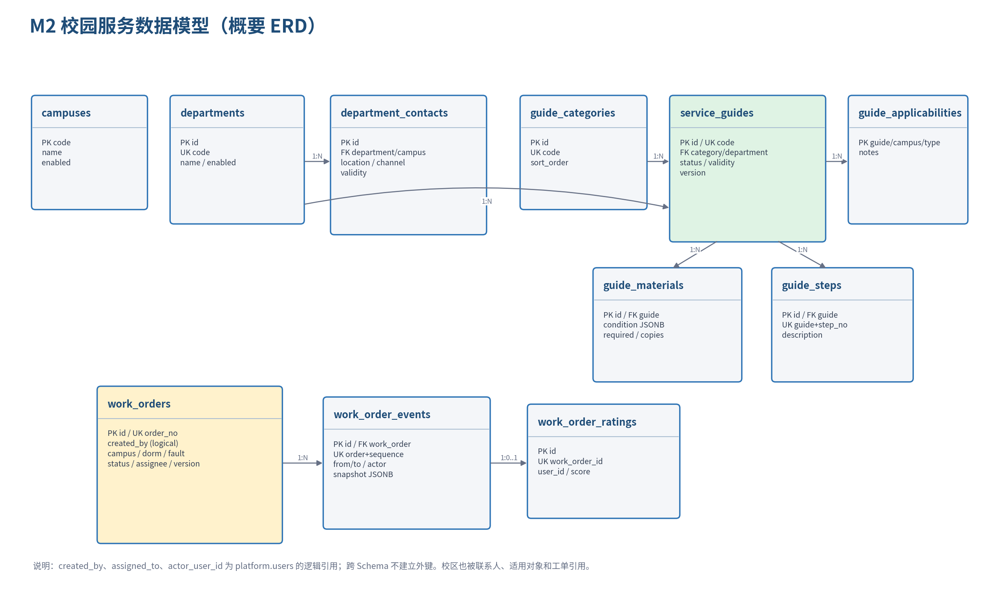

# 学生生活一站式社区 AI 助手

## 详细设计说明书 Part 2：M2 校园服务中心

**文档版本：** V1.1（实现完成版）
**编制日期：** 2026-07-16
**适用迭代：** 10 天 Scrum 演示版  
**关联基线：**《需求分析说明书》V2.1、《概要设计说明书》V1.0、《详细设计 Part 1》V0.11、《详细设计 Part 5》V0.2  
**接口契约：** `openapi.yaml` V0.5.0  
**数据库脚本：** `sql/003_campus_service_schema.sql`、`sql/004_campus_service_seed.sql`、`sql/010_campus_service_electricity_schema.sql`、`sql/011_campus_service_electricity_seed.sql`

| 版本 | 日期 | 说明 | 状态 |
|---|---|---|---|
| V0.9 | 2026-07-14 | M2 指南、联系人、报修工单、状态机、评价和 Mock 适配器 | 待小组评审 |
| V1.0 | 2026-07-15 | 增加 M5 事件 Tools、电费余额与模拟充值申请、确认/幂等适配 | 可进入编码 |
| V1.1 | 2026-07-16 | 同步 15 个 HTTP 操作、AppConfig 范围、真实 Tool Adapter、演示工单与验收结果 | 实现完成 |

> 本篇按用户指定顺序直接设计 M2，M1 暂未展开。公共认证、响应信封、错误、分页、幂等、乐观锁和审计规则继承 Part 1；字段和状态码以 `openapi.yaml` 为机器可读单一事实源。

---

# 1. 设计目标与需求追踪

## 1.1 交付目标

M2 为学生提供校园事项信息与宿舍报修闭环，为成员 B 提供可独立编码和验收的边界。本篇必须实现：

1. 学生可以分类、搜索并查看办事指南，详情包含适用对象、材料、步骤、地点、时间、联系人和更新时间。
2. 材料清单根据校区和学生类型生成，并解释差异项为何出现。
3. 联系人按部门和校区查询，已过期或停用记录默认不可见。
4. 报修创建使用幂等键；学生仅查看本人数据，处理员仅查看授权校区/宿舍区域。
5. 工单严格执行状态机，每次流转产生不可变事件和平台审计。
6. 仅已完成工单的创建者可以评价一次。
7. 外部校园系统通过统一 Protocol 接入；演示环境固定使用 Mock，不依赖真实校务系统。

## 1.2 需求映射

| 需求 ID | 设计落点 | 验收方式 |
|---|---|---|
| SVC-001 | 指南查询、详情模型和指南表组 | 搜索、筛选、详情契约测试 |
| SVC-002 | `MaterialChecklistService` 与条件白名单 | 不同校区/学生类型差异用例 |
| SVC-003 | 联系人有效期、校区索引和默认过滤 | 过期联系人不可见测试 |
| WO-001 | 创建接口、幂等记录和工单事务 | 同 Key 并发提交只生成一单 |
| WO-002 | 所有权与服务范围过滤 | 学生/处理员越权测试 |
| WO-003 | 第 6 章状态机与事件表 | 合法/非法迁移矩阵测试 |
| WO-004 | 唯一评价表和完成状态校验 | 未完成、他人、重复评价测试 |
| SVC-004（P1） | `CampusSystemPort` 和 Mock Adapter | 正常、404、超时、依赖失败测试 |
| SVC-005（P1） | 仅保留接口入口，暂不调用 LLM 自动提交 | 用户确认前不得创建工单 |

## 1.3 范围与非目标

**P0：** 指南、材料清单、部门联系人、报修创建、本人/授权队列查询、详情、时间线、状态流转和评价。

**P1：** 外部事项进度 Mock 查询；智能填单只允许生成草稿，不自动提交。

**不包含：** 真实教务/一卡通/财务写操作、支付、短信通知、维修人员排班优化、地图导航、附件上传、跨部门审批引擎、生产级个人信息加密服务。演示范围外能力不得阻塞 P0。

# 2. 模块边界与代码结构

```text
backend/app/modules/campus_service/
├── api/
│   ├── guide_routes.py
│   ├── department_routes.py
│   └── work_order_routes.py
├── application/
│   ├── guide_service.py
│   ├── material_checklist_service.py
│   ├── work_order_service.py
│   └── service_progress_service.py
├── domain/
│   ├── entities.py
│   ├── work_order_state_machine.py
│   ├── policies.py
│   └── ports.py
├── infrastructure/
│   ├── repositories.py
│   ├── mock_campus_adapter.py
│   └── sqlalchemy_models.py
└── tests/

frontend/src/modules/services/
├── api/                 # 只封装生成客户端，不复制 DTO
├── views/               # 指南、联系人、学生工单、处理队列
├── components/          # 材料清单、状态时间线、状态操作框
├── stores/
└── routes.ts
```

依赖方向为 `api → application → domain`，基础设施实现 domain 中的 Protocol。M2 可读取 M4 提供的认证上下文、权限、幂等和审计服务；不得读取 M4 密码或 Token 表，不得访问 M1/M3 数据表。M4 看板通过 M2 只读统计接口或数据库只读视图获取工单数量，不得更新工单。

# 3. 角色、权限与资源范围

| 角色 | 指南/联系人 | 工单创建 | 工单读取 | 状态流转 | 评价 |
|---|---|---|---|---|---|
| 学生 | 已登录可读 | `work_order:create` | `work_order:read` 且 `created_by=current_user` | 仅本人 `submitted→cancelled` | 本人已完成工单一次 |
| 服务处理员 | 已登录可读 | 通常不创建 | `work_order:read` 且命中授权范围 | `work_order:transition` | 不允许代评 |
| 平台管理员 | 已登录可读 | 非演示入口 | 按显式权限与范围 | 按显式权限 | 不允许代评 |

处理员资源范围实现为 M4 `AppConfig` 的
`campus_service.work_order_service_scopes` JSON；键为处理员用户 UUID，值为严格校验的
校区和非空宿舍区域列表。配置缺失、畸形或无匹配时 fail-closed，不授予处理范围：

```json
{
  "users": {
    "<user_uuid>": [
      {"campus_code": "main", "dormitory_areas": ["演示宿舍区"]}
    ]
  }
}
```

查询必须在 Repository SQL 中加入所有权/范围条件，不能先读取全量数据再由 Service 或前端过滤。对不可见工单统一返回 404，避免利用 UUID 枚举他人数据。

# 4. 数据模型



## 4.1 表设计摘要

| 表 | 关键字段 | 约束/索引 | 责任 |
|---|---|---|---|
| `campuses` | code、name、enabled | code 主键 | 校区字典 |
| `departments` | id、code、name | code 唯一 | 服务部门 |
| `department_contacts` | department、campus、channel、validity | 有效联系人部分查询索引 | 联系窗口与有效期 |
| `guide_categories` | code、name、sort_order | code 唯一 | 指南分类 |
| `service_guides` | category、department、title、status、validity、version | code 唯一；列表/部门索引 | 指南主记录 |
| `guide_applicabilities` | guide、campus、student_type | 三字段联合主键 | 适用对象 |
| `guide_materials` | guide、required、copies、condition | guide 排序索引；condition GIN | 条件化材料 |
| `guide_steps` | guide、step_no、description | guide+step_no 唯一 | 办事步骤 |
| `work_orders` | order_no、owner、location、fault、status、assignee、version | 所有者/队列/处理员索引 | 报修聚合根 |
| `work_order_events` | sequence、from/to、actor、snapshot | order+sequence 唯一 | 不可变状态时间线 |
| `work_order_ratings` | work_order、user、score | work_order 唯一 | 一单一次评价 |

## 4.2 跨 Schema 规则

`created_by`、`assigned_to`、`actor_user_id`、`rating.user_id` 只保存 M4 用户 UUID，不建立 PostgreSQL 跨 Schema 外键。服务层从认证上下文获取用户，不接收客户端自报的 `created_by`。用户停用不会删除历史工单；页面使用事件快照或脱敏用户名显示历史。

## 4.3 数据留存与隐私

- 工单不收集身份证号、支付信息和密码；联系方式默认取登录账号资料，不复制到工单。
- 宿舍房间属于受限信息，仅所有者和授权处理员可见；审计和普通日志只记录工单 ID/单号后四位。
- 工单和事件在演示版不提供物理删除 API。若需要删除演示数据，使用管理员离线脚本并保留审计。
- 指南和联系人采用有效期；默认查询要求 `enabled=true` 且 `valid_until IS NULL OR valid_until>=CURRENT_DATE`。

# 5. 办事指南与材料清单设计

## 5.1 查询规则

指南列表只返回 `published`、未过期且命中适用对象的记录。搜索字段为标题和摘要，排序固定为“分类排序、更新时间倒序”，不接受任意数据库字段排序。指南详情查询必须提供 `campus_code` 和 `student_type`，使返回的材料、联系人和适用性结果可复现。

## 5.2 条件模型

`guide_materials.condition` 只允许以下 JSON 白名单，不执行字符串表达式或动态代码：

```json
{
  "campus_codes": ["main", "east"],
  "student_types": ["undergraduate", "international"]
}
```

空对象表示通用材料；同一维度内为 OR，不同维度间为 AND。未知键在写入/种子校验时拒绝。`MaterialChecklistService` 对每条材料返回 `included` 和 `inclusion_reason`，前端默认只展示 included 项，也可打开“查看差异依据”。

## 5.3 计算伪代码

```text
assert guide is published and not expired
applicability = match(guide, campus_code, student_type)
if not applicability: return applicable=false, materials=[]
for material ordered by sort_order:
  validate condition keys
  campus_ok = no campus condition or campus_code in condition.campus_codes
  type_ok = no type condition or student_type in condition.student_types
  included = campus_ok and type_ok
  explain which general/conditional rules matched
return deterministic checklist
```

相同指南版本和输入必须返回相同清单。指南发生更新时 `version+1`，客户端缓存键应包含 `guide_id + version + campus_code + student_type`。

# 6. 报修工单状态机

## 6.1 状态与合法迁移

```text
submitted ──staff accept──> accepted ──staff start──> processing ──staff finish──> completed
    │                           
    ├──owner cancel──> cancelled
    └──staff reject──> rejected
```

| 当前状态 | 目标状态 | 操作者 | 必要条件/副作用 |
|---|---|---|---|
| 无 | submitted | 学生 | 创建工单和 sequence=1 事件；幂等 |
| submitted | accepted | 授权处理员 | `assigned_to=current_user`，写 accepted_at |
| submitted | rejected | 授权处理员 | reason 必填，写 rejected_at |
| submitted | cancelled | 创建者 | reason 必填，写 cancelled_at |
| accepted | processing | 当前处理员或同范围处理员 | 写 processing_at |
| processing | completed | 当前处理员或同范围处理员 | completion_note 必填，写 completed_at |

`completed`、`cancelled`、`rejected` 为终态。MVP 不允许回退、重新打开、跳级或终态修改；非法迁移返回 409 `WORK_ORDER_ILLEGAL_TRANSITION`。

## 6.2 并发与事务

状态更新使用版本号和行锁双重保护：

1. 按资源范围查询并 `SELECT ... FOR UPDATE`。
2. 校验 `request.version == work_order.version`。
3. 调用纯函数状态机验证迁移和必填副作用。
4. 更新工单状态、时间字段和 `version+1`。
5. 使用 `max(sequence_no)+1` 写入事件；唯一约束防止重复序号。
6. 同事务写 M4 审计；提交后再发送可选通知事件。

创建、迁移和评价均使用 `Idempotency-Key`。同 Key、不同请求体返回 409；同 Key、相同请求体重放首次响应。

## 6.3 工单编号

对外编号格式建议 `WO-YYYYMMDD-NNNN`，由数据库序列或带锁号段服务生成；UUID 仍为内部主键。不得通过“查询当天最大值+1”无锁生成。演示版可在单事务中使用 PostgreSQL sequence。

# 7. 外部校园系统适配器（P1）

```python
class CampusSystemPort(Protocol):
    async def query_progress(
        self, system_code: str, business_no: str, user_id: UUID
    ) -> ServiceProgress: ...
```

`MockCampusSystemAdapter` 从内存/JSON 返回固定数据，支持四种演示结果：正常处理中、已完成、业务号不存在、依赖超时。真实 Adapter 将来必须实现相同协议，不改变路由和 DTO。

| 失败 | 领域错误 | HTTP | 行为 |
|---|---|---:|---|
| 业务号不存在/不属于用户 | `SERVICE_PROGRESS_NOT_FOUND` | 404 | 不区分不存在与无权查看 |
| 上游超时 | `CAMPUS_SYSTEM_TIMEOUT` | 503 | 最多一次短重试，返回 Request-Id |
| 上游格式变化 | `CAMPUS_SYSTEM_INVALID_RESPONSE` | 503 | 记录脱敏诊断，不透传原响应 |
| 不支持的系统 | `CAMPUS_SYSTEM_UNSUPPORTED` | 422 | 不调用 Adapter |

日志只保存 `system_code`、业务号哈希/末四位、耗时和结果，不保存完整业务号。演示配置 `USE_MOCK_CAMPUS_ADAPTERS=true`。

# 8. API 接口设计

## 8.1 M2 操作清单

| 资源 | 方法与路径 | operationId | 权限/规则 |
|---|---|---|---|
| 指南 | GET `/api/v1/service-guides` | listServiceGuides | 已登录；筛选分页 |
| 指南 | GET `/api/v1/service-guides/{guide_id}` | getServiceGuide | 已登录；要求校区和学生类型 |
| 材料 | GET `/api/v1/service-guides/{guide_id}/checklist` | getServiceGuideChecklist | 已登录；可解释清单 |
| 部门 | GET `/api/v1/departments` | listDepartments | 已登录 |
| 部门 | GET `/api/v1/departments/{department_id}` | getDepartment | 已登录；只返回有效联系人 |
| 联系人 | GET `/api/v1/department-contacts` | listDepartmentContacts | 已登录；部门/校区筛选 |
| 工单 | GET `/api/v1/work-orders` | listWorkOrders | `work_order:read` + 资源范围 |
| 工单 | POST `/api/v1/work-orders` | createWorkOrder | `work_order:create` + 幂等 |
| 工单 | GET `/api/v1/work-orders/{work_order_id}` | getWorkOrder | 读权限 + 资源范围 |
| 时间线 | GET `/api/v1/work-orders/{work_order_id}/events` | listWorkOrderEvents | 与工单相同可见性 |
| 状态 | POST `/api/v1/work-orders/{work_order_id}/transitions` | transitionWorkOrder | 处理员权限或本人取消；幂等 |
| 评价 | POST `/api/v1/work-orders/{work_order_id}/rating` | rateWorkOrder | 本人已完成；幂等；一次 |
| 外部进度 | POST `/api/v1/service-progress/queries` | queryExternalServiceProgress | P1；统一 Adapter |

## 8.2 创建工单请求示例

```json
{
  "campus_code": "main",
  "dormitory_area": "梅园",
  "building": "3 号楼",
  "room": "512",
  "fault_category": "plumbing",
  "description": "洗手池下方持续漏水，关闭水龙头后仍有滴漏。",
  "preferred_start_at": "2026-07-15T06:00:00Z",
  "preferred_end_at": "2026-07-15T10:00:00Z"
}
```

校验：描述 10～1000 字；结束时间晚于开始时间；时间段不得早于当前时间；校区必须启用。客户端不得提交 `created_by`、状态、处理员或版本。

## 8.3 状态流转请求示例

```json
{
  "target_status": "completed",
  "reason": "已完成现场维修并由学生确认设备可正常使用",
  "completion_note": "更换老化软管并完成 10 分钟通水测试",
  "version": 3
}
```

接口先做资源权限，再做版本和状态校验。无资源权限返回 404；版本冲突返回 409 `RESOURCE_VERSION_CONFLICT`；非法迁移返回 409 `WORK_ORDER_ILLEGAL_TRANSITION`。

## 8.4 M2 错误码

| 错误码 | HTTP | 说明 |
|---|---:|---|
| `GUIDE_NOT_FOUND` | 404 | 指南不存在、未发布、过期或不适用 |
| `CAMPUS_NOT_FOUND` | 404 | 校区不存在或已停用 |
| `WORK_ORDER_NOT_FOUND` | 404 | 工单不存在或不可见 |
| `WORK_ORDER_ILLEGAL_TRANSITION` | 409 | 状态迁移不在矩阵中 |
| `WORK_ORDER_ALREADY_RATED` | 409 | 已评价一次 |
| `WORK_ORDER_NOT_COMPLETED` | 409 | 非 completed 工单评价 |
| `RESOURCE_VERSION_CONFLICT` | 409 | 乐观锁冲突 |
| `IDEMPOTENCY_CONFLICT` | 409 | 相同 Key 使用不同请求体 |
| `SERVICE_PROGRESS_NOT_FOUND` | 404 | 外部事项不存在或不可见 |
| `CAMPUS_SYSTEM_TIMEOUT` | 503 | 上游超时 |

# 9. 后端对象详细设计

| 对象/协议 | 主要方法 | 事务与职责 |
|---|---|---|
| `ServiceGuideService` | list_guides、get_guide | 发布/有效期/适用对象过滤 |
| `MaterialChecklistService` | build_checklist、explain_rule | 纯计算，不访问 HTTP |
| `DepartmentService` | list_departments、list_contacts | 默认排除过期与停用联系人 |
| `WorkOrderService` | create、get、list_visible、transition、rate | 工单聚合事务边界 |
| `WorkOrderStateMachine` | validate、apply | 纯领域函数，禁止直接 SQL |
| `WorkOrderAccessPolicy` | can_read、can_transition、can_rate | 所有权、权限和范围判定 |
| `GuideRepository` | search_published、get_detail | 预加载关联，避免 N+1 |
| `WorkOrderRepository` | get_visible_for_update、list_visible、save | SQL 层应用资源范围 |
| `WorkOrderEventRepository` | append、list_timeline | 序号唯一、只增不改 |
| `CampusSystemPort` | query_progress | 外部系统抽象 |
| `MockCampusSystemAdapter` | query_progress | 固定演示数据和故障注入 |

路由只解析请求、声明权限并调用 Service；不得在路由中拼接状态迁移 SQL。Repository 不决定“学生是否可取消”，该规则属于 AccessPolicy 和 StateMachine。

# 10. 关键时序

## 10.1 创建工单

```text
学生 → API：POST work-orders + Idempotency-Key
API → M4：认证与 work_order:create
Service → Idempotency：检查 Key 和请求哈希
Service → CampusRepository：校验校区启用
Service → PostgreSQL：插入 WorkOrder(submitted)
Service → PostgreSQL：插入 Event(sequence=1)
Service → M4 Audit：work_order.create（脱敏）
PostgreSQL → Service：提交事务
Service → Idempotency：保存 201 响应
API → 学生：工单详情 + Request-Id
```

## 10.2 状态流转

```text
处理员 → API：目标状态 + version + Idempotency-Key
Service → Repository：按授权范围 FOR UPDATE 查询
Service → Policy/StateMachine：权限、版本、迁移矩阵、必填字段
Service → PostgreSQL：更新状态/version/时间字段
Service → PostgreSQL：追加 WorkOrderEvent
Service → M4 Audit：work_order.transition
PostgreSQL → Service：提交
API → 处理员：新状态和新 version
```

# 11. 前端详细设计

| 页面/组件 | 路由 | 关键行为 |
|---|---|---|
| 服务首页 | `/services` | 分类、搜索、校区和学生类型筛选 |
| 指南详情 | `/services/guides/:id` | 适用性、材料清单、步骤、地点、联系人和更新时间 |
| 部门联系人 | `/services/departments` | 部门/校区筛选；电话和邮件复制 |
| 我的工单 | `/work-orders` | 状态筛选、创建入口、本人数据 |
| 创建工单 | `/work-orders/new` | 结构化表单、时间段校验、提交防抖和幂等 Key |
| 工单详情 | `/work-orders/:id` | 状态时间线、本人取消、完成后评价 |
| 处理队列 | `/staff/work-orders` | 授权区域队列、受理/开始/完成/拒绝操作 |

`serviceContextStore` 保存用户选择的校区和学生类型，指南详情和 checklist 必须使用同一上下文。提交按钮首次点击生成 UUID 作为 Idempotency-Key，失败重试复用该 Key，用户修改表单后必须生成新 Key。

工单状态标签统一映射：submitted=待受理、accepted=已受理、processing=处理中、completed=已完成、cancelled=已取消、rejected=已拒绝。前端不得自行推断可操作按钮，应同时参考状态、当前用户和后端返回权限；后端始终重新校验。

# 12. 安全、审计与可观测性

## 12.1 审计事件

| action | 触发 | before/after |
|---|---|---|
| `work_order.create` | 创建成功 | after 仅含 ID、状态、校区、故障分类 |
| `work_order.transition` | 状态改变 | before/after 状态、版本、处理员 ID |
| `work_order.rate` | 评价成功 | after 含 score，不含评价全文 |
| `service_progress.query` | P1 外部查询 | system_code、业务号哈希、结果 |

审计和结构化日志禁止记录宿舍完整房间、完整外部业务号和工单描述全文。异常返回 Request-Id，不返回 SQL、堆栈或 Adapter 原始响应。

## 12.2 指标

M2 至少暴露：指南查询次数、无结果次数、材料清单生成次数、工单创建数、各状态数量、平均受理时长、平均完成时长、评价均分、Adapter 成功/超时数。标签只使用有限枚举，不把 user_id、order_no 作为指标标签。

# 13. 测试设计

| 层级 | 必测项 | 通过标准 |
|---|---|---|
| 单元 | 条件材料、状态迁移、访问策略、编号生成、Adapter 错误映射 | 领域分支覆盖率 ≥80% |
| 仓储 | 有效期过滤、所有权/范围 SQL、事件序号、唯一评价 | PostgreSQL 测试库通过 |
| API | M2 全部 operationId 的成功、401/403/404/409/422 | 与 OpenAPI V0.5.0 一致 |
| 并发 | 重复创建、双处理员受理、重复评价 | 只有一个业务结果 |
| 契约 | Redocly lint、引用检查、TS 客户端生成 | 无错误或警告 |
| E2E | 登录→指南→材料；登录→创建→处理→完成→评价 | 两条完整主流程通过 |

重点用例：过期联系人不返回；不适用指南返回 404；相同 Idempotency-Key 重放同一 201；相同 Key 改请求体返回 409；学生无法查看他人工单；越权处理员无法受理；submitted 直接 completed 返回 409；completed 重复评价返回 409；两个处理员用相同 version 受理时只有一个成功。

# 14. 成员 B 的 10 天 Scrum 实施包

| 天 | 独立交付 | 对外联调点 |
|---|---|---|
| D1 | M2 包骨架、Schema、迁移、种子数据 | 向全组发布 OpenAPI V0.5.0 |
| D2 | 指南/分类/部门/联系人 Repository 和查询 API | 前端接指南列表和详情 Mock |
| D3 | 材料条件白名单与 checklist API | 固定校区/学生类型测试数据 |
| D4 | 工单创建、编号、幂等和事件 sequence=1 | 前端完成创建表单 |
| D5 | 本人/授权队列、详情、时间线 | 与 M4 联调认证权限和范围 |
| D6 | 状态机、乐观锁、审计、评价 | 处理员页面联调 |
| D7 | MockCampusSystemAdapter、异常注入、TS 客户端 | M1 将来可调用只读工具接口 |
| D8 | 单元/API/并发测试与前端页面收口 | 完整 E2E 冒烟 |
| D9 | 缺陷修复、性能检查、演示数据 | 冻结 M2 API |
| D10 | Compose 验证、README、演示脚本和答辩材料 | 团队 Sprint Review |

若时间不足，优先顺序为：工单主流程 > 指南与材料 > 联系人 > Mock 外部进度。不得为了 P1 牺牲 P0 状态机、权限和幂等测试。

# 15. Vibe Coding 任务包

## 15.1 指南任务提示词

```text
实现 M2 service-guides、departments 和 department-contacts 的查询接口。
以 deliverables/openapi.yaml V0.5.0 为唯一契约；使用 FastAPI、Pydantic v2、SQLAlchemy async。
只返回 published、未过期且适用的指南；材料 condition 只接受 campus_codes/student_types 白名单，返回 inclusion_reason。
Repository 避免 N+1；补 pytest：搜索、适用对象、条件材料、过期联系人、404/422。
不得新增契约外字段，不得执行动态表达式。
```

## 15.2 工单任务提示词

```text
实现 operationId=createWorkOrder/listWorkOrders/getWorkOrder/listWorkOrderEvents/
transitionWorkOrder/rateWorkOrder。严格使用 OpenAPI Schema 和 003_campus_service_schema.sql。
Service 负责事务；StateMachine 是纯函数；Repository 在 SQL 中应用 owner/service_scopes。
创建、迁移、评价实现 Idempotency-Key；迁移实现 version 乐观锁与 FOR UPDATE；每次状态改变追加事件和 M4 审计。
补 pytest：成功、越权、非法迁移、版本冲突、同 Key 不同请求、并发双受理、重复评价。
禁止客户端传 created_by/status/assigned_to，禁止日志记录房间和描述全文。
```

# 16. 环境、迁移顺序与完成定义

## 16.1 环境依赖

沿用 Part 1 的 Python 3.12、FastAPI、SQLAlchemy 2.x async、Alembic、PostgreSQL 16、Redis、Vue 3 和 TypeScript。M2 不新增外部付费依赖；Mock Adapter 数据放 `backend/app/modules/campus_service/fixtures`。环境变量增加：

```text
USE_MOCK_CAMPUS_ADAPTERS=true
CAMPUS_ADAPTER_TIMEOUT_SECONDS=2
WORK_ORDER_IDEMPOTENCY_HOURS=24
```

## 16.2 迁移顺序

1. 执行 `001_platform_schema.sql`。
2. 执行 `002_platform_seed.sql`，确保学生同时具有 `work_order:read/create`。
3. 执行 `003_campus_service_schema.sql`。
4. 执行 `004_campus_service_seed.sql`。
5. 执行 `009_platform_m5_compat.sql`。
6. 执行 `010_campus_service_electricity_schema.sql`。
7. 执行 `011_campus_service_electricity_seed.sql`。
8. 执行 `012_agent_platform_schema.sql` 与 `013_agent_platform_seed.sql`。
9. Python `seed_demo` 创建演示学生/处理员，绑定工单用户 UUID 和演示房间成员 UUID。

## 16.3 Definition of Done

- OpenAPI V0.5.0 lint 无错误或警告，全部 operationId 唯一。
- M2 迁移可在空 PostgreSQL 升级；种子脚本重复执行不产生重复字典。
- 指南、材料、联系人、工单主流程、电费余额与模拟充值 P0 API 完成。
- 所有权、处理范围、幂等、乐观锁、事件与审计测试通过。
- 生成的 TypeScript 客户端可编译，前端无手写重复 DTO。
- 两条 E2E 主流程通过，Docker Compose 下 `/health/ready` 成功。
- README 包含迁移、种子、Mock 故障注入、演示角色和操作顺序。

# 17. M5 Tool Adapter 回补设计

## 17.1 适配层目录与依赖

```text
backend/app/modules/agent_platform/tool_gateway/
  campus_service_adapters.py
  electricity_adapters.py
backend/app/modules/campus_service/
  guides.py
  work_orders.py
  electricity.py
```

Tool Adapter 只把 M5 的冻结强类型参数转换为 M2 Command/Query，调用现有 Application Service；不得调用 Router 或 Repository。REST 入口管理完整事务，内部 Tool 复用调用方已有事务入口，避免嵌套提交；两者共用 `ServiceGuideService/WorkOrderService/ElectricityService`。Tool v1.0.0 Schema、版本与哈希保持不变。

## 17.2 Tool 映射

| Tool | M2 方法 | 权限/资源 | 关键行为 |
|---|---|---|---|
| `service.get_guide` | `ServiceGuideService.search` | 登录用户 + 适用范围 | 最多 10 条有效适用指南；列表 steps 留空，避免 N+1 |
| `work_order.create` | `WorkOrderService.create_from_room_in_transaction` | `work_order:create` + 本人房间 | 从数据库房间绑定解析位置；严格确认、幂等、故障和时间映射 |
| `work_order.get` | `WorkOrderService.get_tool_view` | `work_order:read` + owner scope | 一次加载工单和事件；事件只返回固定状态摘要 |
| `electricity.get_balance` | `ElectricityService.get_balance` | `electricity:read_own` | 只读 Mock；返回 `is_simulated=true` |
| `electricity.create_topup_request` | `ElectricityService.create_topup_request` | `electricity:topup_request:create` | 金额 1–500 元；确认、幂等；不处理真实支付 |

## 17.3 电费数据与规则

- `electricity_accounts` 保存演示房间余额、更新时间和 `source=mock`；用户房间授权仍由 M4 UserContext/M2 资源规则提供。
- `electricity_topup_requests` 保存模拟申请，状态固定为 `simulated`；不更新账户余额，不创建支付订单。
- 金额使用 `numeric(10,2)`；请求不得包含银行卡、支付密码或支付 Token。
- 相同用户、Tool、Idempotency-Key 重放返回首次申请；同 Key 不同金额返回 409。
- 审计只记录房间逻辑 ID、金额、模拟状态和请求 ID，不记录宿舍完整描述。

## 17.4 Tool 错误映射

| M2 异常 | Tool 错误 |
|---|---|
| 非本人房间/工单 | `TOOL_FORBIDDEN` |
| 确认无效 | `TOOL_APPROVAL_INVALID` |
| 幂等冲突 | `IDEMPOTENCY_CONFLICT` |
| 历史位置无法映射授权房间/依赖不可用 | `TOOL_DEPENDENCY_UNAVAILABLE` |
| 故障类型、时间、附件、描述或金额非法 | `TOOL_ARGUMENT_INVALID` |

# 18. 更新后的完成定义

- 5 个 M2 Tools 的 Pydantic Schema 与 OpenAPI/M5 Catalog 一致。
- REST 和 Tool 创建报修得到相同状态机、权限、审计和错误语义。
- 电费查询和模拟充值明确标识 Mock，不修改真实/Mock 余额。
- 用户拒绝确认、确认过期、跨用户确认、重复幂等和 Mock 超时测试通过。
- 原有 M2 API 和表继续可用；P1 功能降级不意味着删除代码。

# 19. 实现与验收状态

- M2 的 15 个公共 OpenAPI `operationId` 已全部注册并保持全局唯一；认证响应和主要错误信封已自动验收。
- `service.get_guide`、`work_order.create`、`work_order.get` 与两个电费 Tool 均在唯一运行时装配中使用真实 M2 Service Adapter；外部校园事项进度仍明确使用 Actor-scoped Mock。
- 演示种子以固定保留 ID 幂等维护 submitted、processing、completed 三类 `WO-DEMO-*` 工单、不可变事件和一次评价，不参与日常工单编号正则。
- Python 全量测试、编译、Alembic 单 Head及离线升降级、OpenAPI 解析和 lint 属于自动关闭门槛。
- 当前环境未提供真实 PostgreSQL、真实校园系统或真实支付，因此真实空库迁移、并发编号/幂等、重复种子和端到端 Tool 调用仍为明确待办，不宣称已完成。
