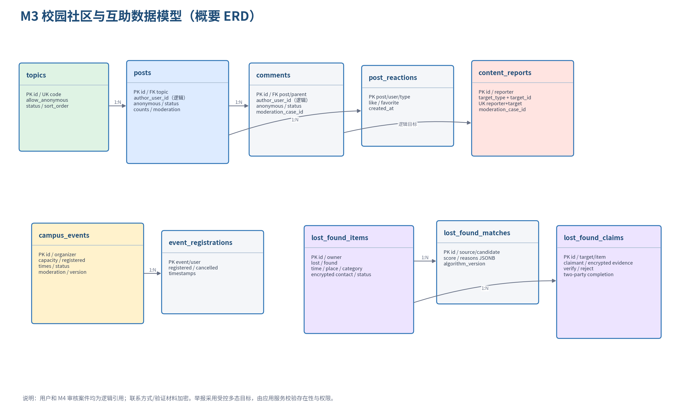

# 学生生活一站式社区 AI 助手 - 详细设计说明书 Part 4

## M3 校园社区与互助｜V1.0｜2026-07-15

| 项目 | 内容 |
|---|---|
| 文档定位 | 10 天 Scrum 中成员 C 可直接编码、联调和验收的 M3 实施规格 |
| 适用范围 | 话题、帖子、评论、匿名树洞、互动、举报、活动、失物匹配、认领 |
| 依赖基线 | 需求说明书 V2.1、概要设计 V1.0、M4 Part 1 V0.11、M5 Part 5 V0.2、`openapi.yaml` V0.5.0 |
| 技术栈 | Python 3.12、FastAPI、SQLAlchemy async、PostgreSQL 16、Vue 3 + TypeScript |
| 仓库边界 | `backend/app/modules/community`、`frontend/src/modules/community` |
| 模块负责人 | 成员 C；不得直接修改 M1 索引、M2 工单或 M4 审核表 |
| 交付脚本 | `sql/007_community_schema.sql`、`sql/008_community_seed.sql` |

> 本分册只完成 M3 的详细设计。P1 热榜、二手交易、图片上传及推荐模型不进入本轮 MVP。

# 1. 设计目标与需求范围

## 1.1 目标

M3 应形成三个互不阻塞但共享内容治理能力的业务闭环：

1. 学生浏览话题，发布普通或匿名帖子，评论、点赞、收藏和举报；低风险内容直接公开，高风险内容进入 M4 审核。
2. 学生发布校园活动；报名在并发情况下不超额，重复请求不重复占位，截止后不能报名。
3. 学生发布失物或拾物信息；系统生成带分数和原因的候选，联系方式默认隐藏，关键特征验证后才允许双方查看，并由双方确认完成。

M3 普通查询 API 在验收数据量下 P95 目标小于 500 ms；列表必须分页，逻辑删除和未通过审核内容不出现在普通列表。

## 1.2 P0 需求追踪

| 需求 | 设计落点 | 验收方式 |
|---|---|---|
| COM-001 话题/帖子/评论 | Topic/Post/Comment、稳定游标式排序字段、逻辑删除 | 创建后分页查询；删除后普通用户 404 |
| COM-002 点赞/收藏/举报 | 唯一互动键、受控举报多态目标、幂等服务 | 重复 PUT/POST 不增加计数 |
| COM-003 匿名树洞 | 话题 `allow_anonymous`、作者脱敏、专用反查权限 | 普通响应无用户 ID；反查有审计 |
| EVT-001 活动和报名 | Event/Registration、行锁、截止/容量校验 | 并发最后一个名额只成功一次 |
| LOST-001 发布与筛选 | LostFoundItem、加密联系方式、时间/地点/类别过滤 | 普通列表仅返回联系方式提示 |
| LOST-002 候选匹配 | 加权规则、阈值配置、分项原因 | 非所有者访问候选返回 403/404 |
| LOST-003 认领与完成 | Claim、加密证据、验证、联系人授权、双方确认 | 未验证不能取联系方式；双方确认后完成 |

## 1.3 非目标

- 不使用 DeepSeek 或向量模型生成社区推荐、审核结论或失物匹配结果。
- 不接入在线支付、二手交易、物流或校园实名系统。
- 不支持帖子/活动图片上传；MARKET-001 和图片能力留到 P1。
- 不实现聊天、站内信和真实通知；报名/认领状态通过列表和详情页展示。
- 不公开匿名身份映射，不让普通运营员默认拥有反查权限。

# 2. M4 前置检查与模块边界

## 2.1 M4 前置检查结论

M4 Part 1 已提供 JWT/RBAC、幂等、敏感内容扫描、审核案件、目标 Handler、审计和配置服务。M3 开始前已补齐两项差距：

- 新增 `community:anonymous_identity:read` 专用权限，仅 `super_admin` 默认拥有。
- `moderation.default_action` 调整为 `allow`，使未命中规则的低风险社区内容可以直接发布；高风险自动发布仍固定为 false。

M3 不需要重新实现 M4，也不直接写 `platform.moderation_cases`。所有审核决策通过 `ModerationTargetHandler` 回调 M3 应用服务。

## 2.2 依赖方向

```text
Vue community 页面
    ↓ OpenAPI 生成客户端
M3 Router → Application Service → Domain Policy/StateMachine
                                    ↓
                     Repository / Encryption / Matcher
                                    ↓
                         community.* PostgreSQL

M3 Application Service → M4 Auth / Moderation / Audit / Config Port
```

M3 可消费 M4 的当前用户和公开用户资料端口，但禁止跨 Schema 查询密码、Token 或角色表。M4 看板只通过 M3 的只读统计端口读取聚合数量。M1/M2 与 M3 的 P0 没有运行时依赖。

## 2.3 建议目录

```text
backend/app/modules/community/
├── api/
│   ├── topics.py
│   ├── posts.py
│   ├── events.py
│   ├── lost_found.py
│   └── schemas.py
├── application/
│   ├── content_service.py
│   ├── interaction_service.py
│   ├── event_service.py
│   ├── lost_found_service.py
│   ├── claim_service.py
│   └── moderation_handler.py
├── domain/
│   ├── entities.py
│   ├── states.py
│   ├── policies.py
│   ├── matcher.py
│   └── errors.py
└── infrastructure/
    ├── repositories.py
    ├── encryption.py
    └── scheduled_jobs.py

frontend/src/modules/community/
├── api/
├── views/{CommunityFeed,PostDetail,EventList,EventDetail,LostFoundList,ClaimCenter}.vue
├── components/{PostCard,CommentList,ReactionBar,ReportDialog,MatchCard,ClaimDialog}.vue
├── stores/
└── routes.ts
```

# 3. 角色、权限和资源范围

| 操作 | 学生 | 内容作者/组织者/记录所有者 | 社区运营员 | 超级管理员 |
|---|---:|---:|---:|---:|
| 查看已发布内容 | 是 | 是 | 是 | 是 |
| 创建帖子、评论、活动、失物 | 是 | 是 | 是 | 是 |
| 修改/删除内容 | 否 | 本人 | `community:moderate` | 是 |
| 创建和维护话题 | 否 | 否 | 是 | 是 |
| 点赞、收藏、举报 | 是 | 是 | 是 | 是 |
| 查看活动报名名单 | 否 | 组织者 | 是 | 是 |
| 查看失物候选 | 否 | 记录所有者 | 不默认 | 是但仍需资源操作说明 |
| 处理认领验证 | 否 | 目标记录所有者 | 不允许代替 | 不允许代替 |
| 反查匿名作者 | 否 | 否 | 默认否 | 专用权限 |

所有 ID 查询先在 SQL 层应用当前用户和内容状态过滤。资源不可见时优先返回 404，避免通过 UUID 判断资源是否存在。公开资料通过 M4 的 `PublicUserProfilePort.get_many(user_ids)` 批量取得，避免 N+1；匿名内容不调用该端口。

# 4. 数据模型



## 4.1 表设计

| 表 | 责任 | 核心约束 |
|---|---|---|
| `topics` | 社区话题及匿名开关 | code/活动名称唯一；逻辑删除 |
| `posts` | 帖子和匿名树洞 | 作者逻辑引用；审核状态；互动计数 |
| `comments` | 评论和单层/多层回复 | parent 必须属于同一 post；审核后才计数 |
| `post_reactions` | 帖子点赞、收藏 | post+user+type 联合主键 |
| `content_reports` | 举报事实和 M4 案件映射 | reporter+target 唯一；受控 target_type |
| `campus_events` | 活动、容量和审核状态 | 时间顺序、容量和 registered_count 约束 |
| `event_registrations` | 用户报名状态 | event+user 联合主键；取消记录保留 |
| `lost_found_items` | 失物/拾物及加密联系方式 | opposite 类型匹配；敏感字段不明文 |
| `lost_found_matches` | 可解释候选快照 | source+candidate+algorithm 唯一；分数 0–1 |
| `lost_found_claims` | 验证和双方完成 | 每用户对目标最多一个活动认领 |

用户 ID 和 M4 审核案件 ID 均为逻辑引用，不建立跨 Schema 外键。M3 删除用户相关内容由应用层策略处理，不通过数据库级联误删审计事实。

## 4.2 计数器一致性

`like_count/favorite_count/comment_count/report_count/registered_count` 是可校验的冗余计数。更新必须与事实表插入/删除位于同一数据库事务：

- 互动使用 `INSERT ... ON CONFLICT DO NOTHING RETURNING`；只有真正插入时加一。
- 取消互动使用 `DELETE ... RETURNING`；只有真正删除时减一并用 `GREATEST(count-1,0)` 防御。
- 评论只在状态首次进入 published 时加一；隐藏/删除已发布评论时减一。
- 举报只在唯一举报行首次创建时加一。
- 每日/演示启动可运行一致性检查 SQL，发现差异以事实表重算并记录审计。

# 5. 内容与审核设计

## 5.1 内容状态机

| 当前状态 | 动作 | 下一状态 | 说明 |
|---|---|---|---|
| 新内容 | M4 allow/mask | `published` | mask 使用清洗文本 |
| 新内容 | M4 review | `pending_review` | 创建审核案件 |
| 新内容 | M4 block | `rejected` | 不公开，保留受控原因 |
| pending_review | M4 approve | `published` | Handler 幂等回写 |
| pending_review | M4 reject | `rejected` | 普通列表不可见 |
| pending_review | M4 escalate | `pending_review` | 案件升级，内容不变 |
| published | 运营隐藏 | `hidden` | 需理由与审计 |
| 任意非 deleted | 作者/运营删除 | `deleted` | 立即对普通列表不可见 |

帖子、评论、活动和失物记录均生成目标 UUID 后调用扫描。`allow/mask` 可直接插入 published；`review/block` 与 M4 案件在同一数据库事务中创建。若 M4 服务异常，采用安全失败：返回 503，不创建半完成内容。

## 5.2 Handler 契约

M3 注册四种目标：`post/comment/event/lost_found`。Handler 输入为 `case_id,target_id,decision,reason,expected_version`，处理规则：

1. 按目标 ID 加行锁，校验 `moderation_case_id` 和当前状态。
2. 重复相同决策返回当前结果，不重复修改计数。
3. approved 设置 published/published_at；comment 首次发布时增加帖子评论计数。
4. rejected 设置 rejected；escalated 保持 pending_review。
5. 目标已 deleted 时不恢复内容，只把回调记为已处理。

M4 案件和 M3 状态在同一 PostgreSQL 数据库中由应用服务编排事务，M4 不直接执行 M3 SQL。

## 5.3 Markdown 安全

正文只保存 Markdown，不接受原始 HTML。前端使用 `markdown-it` 的 `html:false`，再通过 DOMPurify 允许列表净化；链接协议只允许 `https/http/mailto`，外链增加 `rel="noopener noreferrer"`。详情和卡片均以文本方式显示审核理由，不渲染服务端错误中的 HTML。

# 6. 帖子、评论和互动

## 6.1 话题和匿名树洞

话题由运营员维护。只有 `allow_anonymous=true` 的话题可以提交匿名帖子或匿名评论；服务端忽略客户端伪造的作者字段。匿名响应固定：

```json
{
  "user_id": null,
  "display_name": "匿名同学",
  "avatar_url": null,
  "is_anonymous": true
}
```

普通帖子返回 M4 提供的公开昵称和头像，不返回邮箱、手机号、部门内部字段。帖子由匿名改为实名或反向修改均视为内容更新，需要版本校验和重新扫描。

## 6.2 匿名身份反查

`POST /api/v1/community/anonymous-identities/reveal` 要求专用权限和 2–500 字事由。成功与失败均记录 actor、target_type、target_id、reason、request_id 和结果；审计中不重复保存被反查用户 ID。响应设置 `Cache-Control: no-store`，前端不写 Pinia/localStorage，也不提供批量反查。

## 6.3 评论规则

- 只能评论 published 帖子。
- `parent_comment_id` 必须是同一帖子的 published 评论；V0.9 前端只展示两层，数据库允许保留父引用。
- 待审核评论不进入普通列表，也不增加 comment_count。
- 删除父评论后子评论保留，父位置显示“内容已删除”。
- 更新评论需要 version；已发布评论在重新审核期间暂时不可见。

## 6.4 点赞与收藏

使用 PUT 表示期望互动存在、DELETE 表示期望不存在；两种调用均幂等，不要求 Idempotency-Key。只能操作 published 帖子。响应同时返回 active 和最新计数，前端以服务端结果纠正乐观 UI。

## 6.5 举报

举报目标限定 post/comment/event/lost_found。举报人不能举报不可见或已删除目标，details 必填，不能由前端提交审核状态。首次举报：

1. 插入唯一 `content_reports`，原子增加目标 report_count（有该字段的目标）。
2. 目标已有 pending M4 案件时直接关联；否则创建新的 M4 案件。
3. 同一举报人重复操作返回首次举报，不重复计数。
4. 多名用户可以举报同一目标，但全部关联同一未结案件。

# 7. 校园活动和并发报名

## 7.1 活动时间规则

`starts_at < ends_at`，`registration_deadline <= starts_at`，创建时开始时间必须晚于当前时间。只有 published 且当前时间未超过 deadline 的活动可报名。取消活动必须提交原因；ended/cancelled/rejected 活动不可编辑或报名。

## 7.2 报名事务

```text
IdempotencyService.replay_or_begin()
BEGIN
SELECT event FOR UPDATE
校验 published、未截止、未满员
查询 registration(event,user)
已 registered → 返回当前结果
不存在/已 cancelled → INSERT 或 UPDATE registered
registered_count = registered_count + 1
COMMIT
IdempotencyService.complete(response)
```

`SELECT ... FOR UPDATE` 使同一活动的最后名额串行决定。数据库约束保证 `registered_count <= capacity`，联合主键保证同一用户只占一个位置。等待锁设置短超时；超时转换为 409 `EVENT_REGISTRATION_BUSY`，前端可刷新重试。

取消报名同样锁定活动和报名行。只有状态从 registered 变为 cancelled 才把计数减一；重复取消返回 cancelled。活动开始后默认不允许取消，运营员不代替学生报名或取消。

## 7.3 活动结束

Celery Beat/轻量定时任务每分钟把 `ends_at <= now()` 的 published 活动置为 ended。即使调度器暂时未运行，列表和报名 SQL 仍按时间过滤，不能仅依赖状态字段。

# 8. 失物招领详细设计

## 8.1 联系方式和验证材料

`contact_value` 和认领 evidence 不以明文写数据库。应用层使用 `cryptography` 的 AES-GCM/Fernet 认证加密，密钥来自 `COMMUNITY_DATA_ENCRYPTION_KEY`。数据库只保存 ciphertext 和不可逆展示提示，如手机号 `***1234`。

列表和普通详情永不返回完整联系方式；目标所有者与已 verified/completed 认领双方可调用专用 contact 接口。接口设置 no-store，每次访问写 `lost_found.contact.reveal` 审计。日志、异常、幂等响应快照均不得保存完整联系方式或 evidence。

## 8.2 候选筛选

候选必须满足：与源记录类型相反；状态为 published/claiming；未删除；非同一记录所有者；发生时间差不超过配置窗口 30 天。再按以下确定性公式计算：

```text
score = 0.35 × category_score
      + 0.25 × location_score
      + 0.20 × time_score
      + 0.20 × keyword_score
```

| 因子 | 算法 | 解释示例 |
|---|---|---|
| category | 规范化类别完全相同为 1，否则 0 | “类别一致：校园卡” |
| location | 分词 Jaccard；包含关系设最低 0.7 | “地点均包含一教” |
| time | `max(0,1-相差天数/30)` | “发生时间相差 1 天” |
| keyword | 标题+描述去停用词后的 token Jaccard | “共同关键词：蓝色、卡套” |

总分至少 0.55 才保存/返回。权重总和必须为 1，配置加载时校验；算法版本如 `rule-v1` 写入匹配表。结果按 score 降序，仅源记录所有者可见，并返回四个分项原因，不向候选公开谁查看了它。

MVP 数据量小，发布或修改后同步扫描最近最多 200 条候选；失败不影响内容发布，返回 `match_status=pending` 并允许后台重算。大规模异步匹配留到 P1。

## 8.3 认领状态机

| 当前状态 | 操作者 | 动作 | 下一状态 |
|---|---|---|---|
| 无 | 认领人 | 提交关键特征 | pending |
| pending | 目标所有者 | 验证通过 | verified |
| pending | 目标所有者 | 拒绝并填写原因 | rejected |
| pending | 认领人 | 取消 | cancelled（P1 可补接口） |
| verified | 任一方 | 确认完成 | verified（单方已确认） |
| verified | 另一方 | 确认完成 | completed |

认领人不能认领自己的目标记录。若提供 `claimant_item_id`，它必须属于认领人、类型与目标相反且仍有效。目标所有者查看解密后的 evidence 后才能决定；M3 不使用 AI 自动判断关键特征。

## 8.4 双方完成事务

完成接口锁定 claim、target item 和可选 claimant item；多个 item 按 UUID 排序加锁以避免死锁。记录当前调用方确认时间；只有双方均确认时：

- claim.status=completed，填写 completed_at；
- target item.status=completed；
- claimant item 存在时也置 completed；
- 相关候选从后续查询中排除；
- 写一条不含联系方式/证据的审计。

# 9. API 联调契约

`openapi.yaml` V0.5.0 是字段、状态码和 operationId 的唯一事实源。M3 的既有路径与操作保持不变；M5 增量合并后项目共 100 个路径、136 个操作。

## 9.1 社区内容接口

| 资源 | 主要接口 | operationId |
|---|---|---|
| 话题 | GET/POST `/topics` | listTopics/createTopic |
| 话题 | GET/PATCH/DELETE `/topics/{topic_id}` | getTopic/updateTopic/deleteTopic |
| 帖子 | GET/POST `/posts` | listPosts/createPost |
| 帖子 | GET/PATCH/DELETE `/posts/{post_id}` | getPost/updatePost/deletePost |
| 评论 | GET/POST `/posts/{post_id}/comments` | listPostComments/createComment |
| 评论 | PATCH/DELETE `/comments/{comment_id}` | updateComment/deleteComment |
| 互动 | PUT/DELETE `/posts/{post_id}/reactions/{type}` | putPostReaction/deletePostReaction |
| 举报 | POST `/reports` | createContentReport |
| 匿名反查 | POST `/community/anonymous-identities/reveal` | revealAnonymousIdentity |

## 9.2 活动接口

| 接口 | operationId | 关键约束 |
|---|---|---|
| GET/POST `/events` | listCampusEvents/createCampusEvent | 筛选；创建需幂等和审核 |
| GET/PATCH `/events/{event_id}` | getCampusEvent/updateCampusEvent | 组织者/运营员；版本控制 |
| POST `/events/{event_id}/cancel` | cancelCampusEvent | 原因+version+幂等 |
| GET/POST `/events/{event_id}/registrations` | listEventRegistrations/registerCampusEvent | 名单限组织者；报名锁容量 |
| DELETE `/events/{event_id}/registrations/me` | cancelMyEventRegistration | 本人幂等取消 |

## 9.3 失物接口

| 接口 | operationId | 关键约束 |
|---|---|---|
| GET/POST `/lost-found` | listLostFoundItems/createLostFoundItem | 联系方式默认隐藏/加密 |
| GET/PATCH/DELETE `/lost-found/{item_id}` | get/update/deleteLostFoundItem | 所有者资源规则 |
| GET `/lost-found/{item_id}/matches` | listLostFoundMatches | 仅记录所有者 |
| POST `/lost-found/{item_id}/claims` | createLostFoundClaim | evidence 加密 |
| GET `/lost-found-claims` | listMyLostFoundClaims | 本人发起/待本人处理 |
| GET `/lost-found-claims/{claim_id}` | getLostFoundClaim | 仅双方 |
| POST `.../{claim_id}/decision` | decideLostFoundClaim | 仅目标所有者 |
| GET `.../{claim_id}/contact` | getLostFoundClaimContact | verified 后双方；no-store |
| POST `.../{claim_id}/completion` | confirmLostFoundClaimCompletion | 双方分别确认 |

## 9.4 领域错误码

| 错误码 | HTTP | 场景 |
|---|---:|---|
| `COMMUNITY_ANONYMOUS_NOT_ALLOWED` | 422 | 话题未开启匿名 |
| `COMMUNITY_CONTENT_PENDING_REVIEW` | 409 | 对待审核内容执行公开互动 |
| `EVENT_REGISTRATION_CLOSED` | 409 | 已截止或活动不可报名 |
| `EVENT_CAPACITY_FULL` | 409 | 活动满员 |
| `EVENT_REGISTRATION_BUSY` | 409 | 并发锁等待超时 |
| `LOST_FOUND_MATCH_FORBIDDEN` | 403/404 | 非所有者查看候选 |
| `LOST_FOUND_CLAIM_INVALID` | 409 | 自己认领、类型相同或状态错误 |
| `LOST_FOUND_CONTACT_NOT_AVAILABLE` | 409 | 尚未验证就读取联系方式 |
| `RESOURCE_VERSION_CONFLICT` | 409 | 乐观锁版本不一致 |

# 10. 后端对象职责

| 对象/协议 | 主要方法 | 责任 |
|---|---|---|
| `CommunityContentService` | create/update/delete post/comment | 内容扫描、状态、计数与事务 |
| `ContentAccessPolicy` | can_read/edit/delete/reveal | 所有权、审核状态、匿名权限 |
| `ReactionService` | put/delete | 唯一事实和计数幂等 |
| `ReportService` | submit | 目标解析、重复举报、M4 案件复用 |
| `CampusEventService` | create/update/cancel/register/unregister | 活动聚合和容量行锁 |
| `LostFoundService` | create/update/list_matches | 加密、筛选和匹配 |
| `LostFoundMatcher` | score/explain | 纯函数，可单元测试 |
| `ClaimService` | create/decide/reveal_contact/confirm | 认领状态机和双方授权 |
| `CommunityModerationHandler` | approve/reject/escalate | M4 回写适配器 |
| `CommunityRepository` | get_visible/get_for_update/list | SQL 层资源过滤与锁 |
| `SensitiveDataCipher` | encrypt/decrypt/hint | 联系方式和 evidence 认证加密 |
| `PublicUserProfilePort` | get_many | M4 公开资料批量查询 |

Router 只负责输入校验、权限声明和调用 Service；不得直接修改状态或计数。Matcher 和 StateMachine 是纯函数，不访问数据库或 HTTP。

# 11. 前端详细设计

## 11.1 CommunityFeed 与 PostDetail

Feed 按话题筛选并使用服务端排序；卡片显示审核状态仅限作者自己的 `mine=true` 列表。PostDetail 加载帖子和分页评论，ReactionBar 可乐观更新但必须用响应计数校准。待审核/驳回内容只在“我的发布”中显示。

发布表单根据 Topic.allow_anonymous 决定是否显示匿名开关。匿名开关旁说明“平台在安全治理场景下可由专门授权人员反查，并记录审计”，不承诺绝对不可追溯。

## 11.2 活动页面

EventList 支持类别、时间和有余位筛选。报名按钮根据 status、deadline、capacity 和 my_registration_status 控制，但最终以 API 为准。409 满员/截止后刷新详情；重复点击只保留一个请求。

组织者在详情页可查看报名名单和取消活动；普通参与者只看到人数，不获取全部报名用户列表。

## 11.3 失物与认领中心

LostFoundList 默认不显示完整联系方式。所有者详情出现“候选匹配”标签；MatchCard 显示总分和四个原因，并提供认领入口。ClaimCenter 分“我发起的”和“待我验证”，验证证据只在授权详情中展示。

联系人抽屉只有 verified 后才请求 contact API；关闭抽屉即清空内存数据，不写 Store、缓存或埋点。

## 11.4 XSS 与显示

Markdown 组件统一封装，不在业务页面使用 `v-html` 渲染未净化文本。匿名身份、联系方式、证据等敏感响应禁止被通用请求缓存插件缓存；错误提示不得回显原始敏感输入。

# 12. 安全、隐私与滥用防护

## 12.1 对象级授权

UUID 不是授权。帖子作者、活动组织者、失物所有者、认领双方等规则在 Repository 查询和 Service 中同时体现。批量/分页接口也必须带资源范围，不能先查全部后由前端隐藏。

## 12.2 限流建议

| 操作 | 演示默认 | 键 |
|---|---:|---|
| 发布帖子/评论 | 10 次/分钟 | user_id |
| 举报 | 5 次/分钟 | user_id + target |
| 活动报名 | 10 次/分钟 | user_id |
| 创建认领 | 5 次/小时 | user_id |
| 匿名反查 | 3 次/小时 | actor_user_id |
| 联系方式查看 | 10 次/小时 | user_id + claim |

限流值可由 Redis 和平台配置调整；超限返回 429，不把用户输入写入限流日志。

## 12.3 敏感数据

- `COMMUNITY_DATA_ENCRYPTION_KEY` 仅由 API 容器读取，不进入前端、数据库配置或 Git。
- 匿名作者映射不复制到额外表或缓存；以内容表 author_user_id 为唯一事实。
- 审计记录反查和联系人查看，但不复制联系方式、证据和完整正文。
- 演示数据使用虚构联系方式，禁止导入真实学生隐私。

# 13. 测试设计

## 13.1 单元测试

- Content Policy：匿名话题开关、作者/运营权限、状态可见性。
- Matcher：类别、地点、时间、关键词分项和权重总和；0.55 边界。
- 状态机：内容审核、活动取消/结束、认领验证/双方完成。
- Cipher：随机 nonce、篡改密文失败、提示生成、不在异常输出明文。
- Markdown：脚本标签、javascript 链接、事件属性和危险图片被清除。

## 13.2 集成和并发测试

1. 普通/匿名帖子创建，M4 allow/review/block 三种扫描结果均落到正确状态。
2. 普通学生无法从任一公开响应、错误或日志取得匿名 author_user_id。
3. 20 个并发请求争抢最后一个活动名额，只一个从 registered_count=N-1 变为 N。
4. 同一报名、点赞、收藏、举报重放不产生重复事实或计数。
5. 停止/删除内容后普通列表和直接详情均不可见。
6. 失物候选只对 source owner 返回；交换 source/item UUID 仍不能越权。
7. 未验证 claim 的 contact 返回 409；非参与者返回 404。
8. 双方并发确认完成只生成一个 completed 结果，不死锁、不负计数。
9. M4 同案件重复回调不重复发布或增加评论计数。

## 13.3 E2E 主流程

- 社区：学生发布匿名树洞 → 另一学生评论/点赞 → 举报 → 运营审核 → 内容隐藏。
- 活动：组织者发布 → 审核通过 → 两名学生报名/一人取消 → 组织者查看名单。
- 失物：发布 lost 和 found → 查看匹配原因 → 创建认领 → 所有者验证 → 查看联系方式 → 双方确认完成。

# 14. 成员 C 的 10 天 Scrum 实施包

| 天 | M3 可独立交付 | 联调点 |
|---:|---|---|
| C1 | 模块骨架、DDL、ORM、权限和错误码 | M4 当前用户与新权限 |
| C2 | Topic/Post/Comment CRUD、公开资料批量端口 | 前端生成 DTO |
| C3 | M4 scan、审核状态和 TargetHandler | M4 ModerationService |
| C4 | 点赞、收藏、举报、计数一致性 | M4 案件复用/审计 |
| C5 | Event CRUD、报名行锁和并发测试 | PostgreSQL 测试库 |
| C6 | LostFound CRUD、加密和筛选 | 环境密钥/演示数据 |
| C7 | Matcher、候选权限、认领验证 | 无跨模块依赖 |
| C8 | 社区、活动、失物前端页面 | M4 路由壳和生成客户端 |
| C9 | 全量权限、XSS、并发和 E2E | 全组集成环境 |
| C10 | 演示数据、修复、README 和彩排 | OpenAPI 冻结 |

C3 和 C7 结束做模块内部 Review；C9 做全组联调。成员 C 的 PR 不应包含 M1/M2 领域表修改，M4 契约变更必须先提交 OpenAPI/Part 1 差异。

# 15. Vibe Coding 任务卡

## 15.1 社区内容任务

> 实现 Topics、Posts、Comments API。严格使用 `openapi.yaml` V0.5.0 和 `007_community_schema.sql`。匿名只允许 allow_anonymous 话题；公开 DTO 不得泄露 author_user_id。创建/更新调用 M4 scan，注册 ModerationTargetHandler，补 allow/review/block 和重复回调测试。禁止修改 M4 表。

## 15.2 互动和举报任务

> 实现 put/deletePostReaction 与 createContentReport。用事实表 RETURNING 控制冗余计数，同用户重复操作幂等。举报解析受控 target_type，复用目标未结 M4 案件；补重复、并发、目标不可见和自报测试。

## 15.3 活动任务

> 实现 CampusEvent 和 Registration API。报名事务必须 SELECT FOR UPDATE 活动，校验 published、deadline、capacity，event+user 唯一；重放不重复占位。补 20 并发争抢最后名额、重复取消、版本冲突测试。

## 15.4 失物任务

> 实现 LostFound、Matcher 和 Claim API。联系方式和 evidence 使用环境密钥认证加密；普通列表不返回明文。匹配固定 35/25/20/20 和 0.55 阈值，返回四项原因，仅 owner 可见。验证通过后 contact 才可访问，双方确认后完成。补 IDOR、篡改密文和并发确认测试。

## 15.5 前端任务

> 使用 OpenAPI 生成类型实现 CommunityFeed/PostDetail/Event/LostFound/ClaimCenter。Markdown html=false 并 DOMPurify；敏感 contact/reveal 响应不缓存。409 时刷新服务端状态，匿名页面不得把真实用户字段写 Store 或日志。

# 16. 环境、迁移和完成定义

## 16.1 依赖

M3 沿用 FastAPI、Pydantic v2、SQLAlchemy 2、asyncpg、Alembic、Redis、Vue 3、TypeScript、Vitest、Playwright。新增后端依赖仅 `cryptography`；前端使用 `markdown-it` 和 `dompurify`。匹配可用 Python 标准库字符 n-gram，不强制引入 jieba 或机器学习库。

必需环境变量：

```dotenv
COMMUNITY_DATA_ENCRYPTION_KEY=<本机生成的32字节认证加密密钥>
COMMUNITY_MATCH_ALGORITHM_VERSION=rule-v1
COMMUNITY_CONTACT_AUDIT_ENABLED=true
```

密钥生成命令进入 README，真实值不提交。四人共享演示数据时只共享密文无意义，统一由 `seed_demo` 在目标环境重新生成。

## 16.2 迁移顺序

1. `001_platform_schema.sql`
2. `002_platform_seed.sql` V2（含匿名反查权限和 allow 默认动作）
3. M2 的 003/004
4. M1 的 005/006
5. `007_community_schema.sql`
6. `008_community_seed.sql`
7. `009_platform_m5_compat.sql`
8. M2 电费增量 010/011
9. M5 的 012/013
10. Python `seed_demo community`

## 16.3 Definition of Done

- OpenAPI V0.5.0 lint 无错误或警告，136 个 operationId 唯一，生成 TypeScript 客户端可编译。
- 10 张 M3 表在空 PostgreSQL 迁移成功，升级/回滚策略记录在 Alembic。
- 三条 E2E 主流程通过，匿名身份和联系方式无泄漏。
- 报名最后名额、互动计数、双方完成并发用例通过。
- 所有 P0 API 至少覆盖成功、认证、权限、校验、冲突。
- 后端核心服务覆盖率不低于 70%，Matcher/Policy/StateMachine 目标不低于 85%。
- README 包含密钥生成、迁移、种子、测试、演示账号和演示顺序。

# 17. 开发前需要准备

1. 由 M4 创建两个学生、一个社区运营员和一个超级管理员演示账号。
2. 生成本机 `COMMUNITY_DATA_ENCRYPTION_KEY`，不得使用示例弱密钥。
3. 准备 4–6 条虚构帖子、两个活动、至少两对可匹配失物/拾物及一条不匹配样例。
4. 确认树洞话题的展示说明和匿名反查告知文案。
5. 确认活动演示的开始/截止时间，避免彩排时自动过期。

# 18. 参考资料

- PostgreSQL Documentation, “Explicit Locking”, https://www.postgresql.org/docs/current/explicit-locking.html
- PostgreSQL Documentation, “INSERT / ON CONFLICT”, https://www.postgresql.org/docs/current/sql-insert.html
- OWASP Cheat Sheet Series, “Cross Site Scripting Prevention”, https://cheatsheetseries.owasp.org/cheatsheets/Cross_Site_Scripting_Prevention_Cheat_Sheet.html
- OWASP Cheat Sheet Series, “Authorization”, https://cheatsheetseries.owasp.org/cheatsheets/Authorization_Cheat_Sheet.html
- OWASP Cheat Sheet Series, “Insecure Direct Object Reference Prevention”, https://cheatsheetseries.owasp.org/cheatsheets/Insecure_Direct_Object_Reference_Prevention_Cheat_Sheet.html

---

文档版本：V1.0。M3 编码前优先评审：活动容量锁、0.55 匹配阈值、联系方式加密、M5 Tool Schema 和写操作确认。

# 19. M5 Tool Adapter 回补设计

## 19.1 首期范围调整

M3 原有帖子、评论、匿名、举报、活动、失物和认领需求全部保留；首期优先实现活动和失物事件 Tools，通用帖子/评论/点赞后台调整为 P1。

| Tool | M3 方法 | 权限/范围 | 风险 |
|---|---|---|---|
| `event.search` | `CampusEventService.search_open` | `community:read` | R0，只读 |
| `event.register` | `CampusEventService.register` | `community:write` + 当前用户 | R2，确认/幂等 |
| `lost_found.publish` | `LostFoundService.publish` | `community:write` | R2，确认/内容检查 |
| `lost_found.search_matches` | `LostFoundService.list_matches_for_owner` | `community:read` + owner scope | R1，隐私只读 |

## 19.2 目录与依赖

```text
backend/app/modules/community/
  tool_adapters/
    event_tools.py
    lost_found_tools.py
```

Tool Adapter 只调用 M3 Application Service。M5 的 approval 不能替代 M3 容量、所有权、可见性、内容审核和并发检查。

## 19.3 event.search / event.register

- search 只返回 `published`、未取消、报名未截止的活动；分页最大 100。
- register 必须有 M5 有效确认和 Idempotency-Key；M3 使用既有行锁/唯一约束保证最后名额不超卖。
- Agent 重试时返回已有报名记录，不重复扣减容量。

## 19.4 lost_found.publish / search_matches

- publish 输入限定 lost/found、标题、类别、地点、时间、描述和 `contact_preference=in_app`。
- Agent Prompt/Tool 参数不得接收明文电话；联系方式继续由既有加密字段和专用接口管理。
- 发布前调用 M4/M5 内容安全管线；高风险进入原 M4 审核状态机。
- search_matches 必须验证 item 属于当前用户，只返回分数、原因和候选摘要，不返回对方联系方式或认领证据。

## 19.5 错误与轨迹映射

| M3 异常 | Tool 错误 |
|---|---|
| 活动取消/截止 | `EVENT_REGISTRATION_CLOSED` |
| 容量已满 | `EVENT_CAPACITY_FULL` |
| 重复报名 | 返回已有 registration，不视为失败 |
| 失物记录非本人 | `TOOL_FORBIDDEN` |
| 内容被阻止 | `CONTENT_POLICY_BLOCKED` |
| 匹配未生成 | 返回空 items + algorithm_version，不编造候选 |

## 19.6 完成定义

- 四个 Tool Schema 与 OpenAPI/M5 Catalog 一致。
- 报名确认、拒绝、过期、重复请求和并发最后名额测试通过。
- 失物发布不在 Tool/Agent 轨迹保存联系方式；候选查询不泄露隐私。
- M5 未启用时，原 M3 REST API 与审核流程仍独立可用。
# 实现完成说明（2026-07-16）

M3 后端已实现 OpenAPI 定义的 38 个 operationId。活动报名在同一事务中设置 PostgreSQL
局部 1 秒锁超时并锁定活动与报名行；失物认领完成按 UUID 排序锁定相关物品，避免锁顺序
不一致。真实 PostgreSQL 的竞争场景仍需在环境可用后补充集成验证。

联系方式与认领 evidence 使用 `COMMUNITY_DATA_ENCRYPTION_KEY` 驱动的 Fernet 认证加密。
密钥缺失不会影响模块导入、健康检查、公开内容和活动能力，只会使敏感写入/解密安全不可用。
普通列表与详情仅返回 contact hint；验证通过后的联系方式响应固定 `Cache-Control: no-store`
并写脱敏审计。Matcher 使用 NFKC、固定中文双字/拉丁 token 和 AppConfig 中的四因子权重，
结果量化为 5 位小数；内容写入中的重算放在 savepoint，失败不会回滚已发布内容。

M5 的 `event.search`、`event.register`、`lost_found.publish` 和
`lost_found.search_matches` 已在唯一 RuntimeCompositionFactory 中替换为真实应用服务 Adapter，
Tool v1.0.0 Schema 与哈希保持不变。写 Tool 继续强制审批与幂等，数据库无法表达的活动
campus 筛选明确返回参数错误，不伪造筛选结果。
