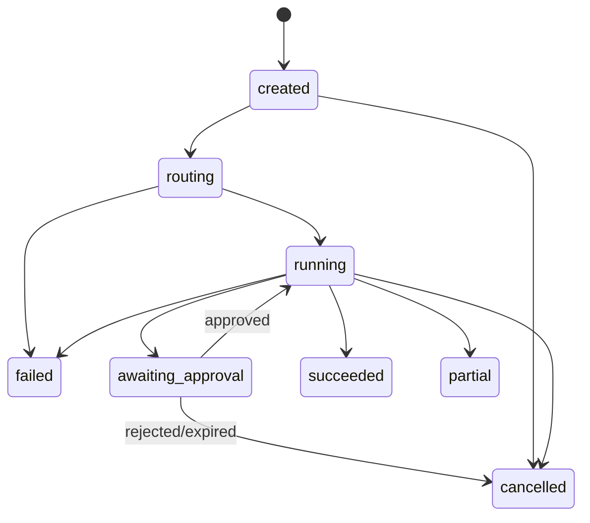
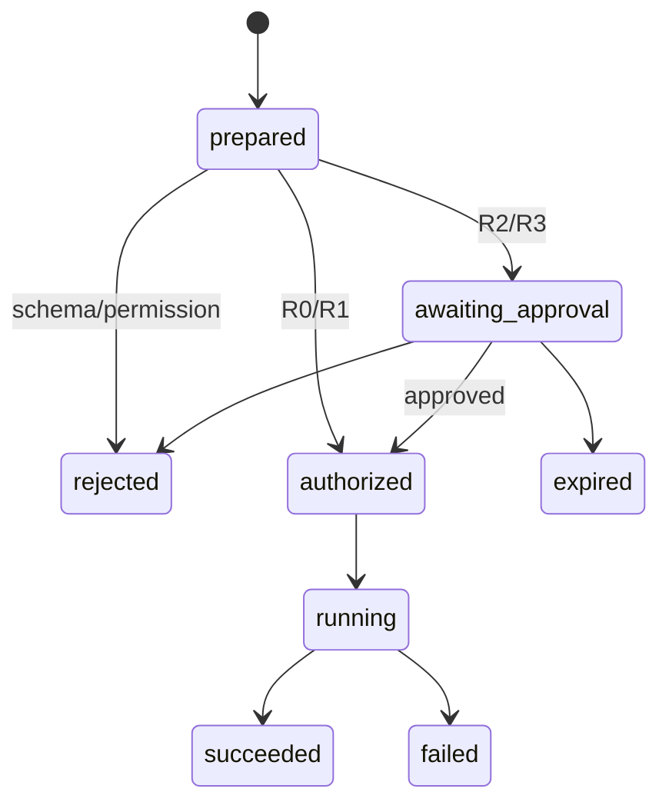
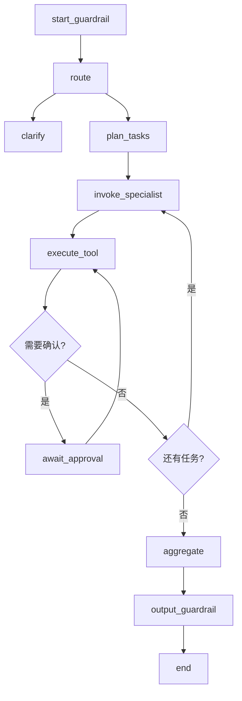

# 学生生活一站式社区 AI 助手

## 详细设计说明书 Part 5：智能体与模型工程（M5）

文档版本：V0.2  
编制日期：2026-07-15  
需求基线：《01-需求分析说明书》V2.1  
概要设计：《02-概要设计说明书》V1.0  
关联模块：M1 知识、M2 校园事件、M3 社区事件、M4 治理
机器契约：`openapi.yaml` V0.5.0  
数据库脚本：`sql/009_platform_m5_compat.sql`～`sql/013_agent_platform_seed.sql`

> 本篇是 M5 的可编码设计基线。P0 以内部 Tools 和受控多智能体为主；MCP、RAG Reranker、LoRA/QLoRA、Agent 交接、并行为 P1。复杂问答固定使用 `deepseek-v4-pro`，本地仅运行不超过 3B 的小型指令模型、Embedding 和轻量 Reranker。

# 1. 目标、范围与兼容性

## 1.1 设计目标

1. 把 M1–M4 的领域能力注册为具有强类型、权限、风险和超时的 Tools。
2. 实现 Supervisor + 五类专业 Agent 的有界协作，满足 MA-001～007。
3. 对报修、活动报名、失物发布、电费模拟充值等写操作强制人工确认。
4. 保存可查询的 Agent、Tool、确认、模型和评估轨迹。
5. 支持数据集、训练任务、模型版本、评估和回滚。
6. 为 P1 的 MCP、Reranker、LoRA/QLoRA、MA-008～010预留稳定扩展点。

## 1.2 P0/P1 边界

| 能力 | P0 | P1 |
|---|---|---|
| 路由 | 规则 + DeepSeek 兜底 | 本地小模型优先、低置信 DeepSeek |
| 多智能体 | 注册、单 Agent、Supervisor 顺序分解、轨迹、确认、终止/降级 | AgentHandoff、并行执行、小模型路由 |
| Tools | 14 个内部事件 Tools | 查询类 MCP 映射 |
| RAG | bge + Chroma + DeepSeek | 本地 Reranker |
| 模型工程 | 数据集、模型注册、评估元数据和任务骨架 | 真实 LoRA/QLoRA 训练和发布 |
| 管理页面 | Agent 运行、Tool Catalog、数据集/模型最小页面 | 完整训练参数和对比报表 |

## 1.3 M4 已完成时的兼容结论

现有 M4 无需推倒重来。下列能力可直接复用：JWT Claims、`require_permissions`、`RbacService`、`AuditService`、`ConfigService`、`idempotency_records`、Request-Id 和统一错误信封。

| 检查项 | 现状 | M5 影响 | 处理方式 |
|---|---|---|---|
| 权限码 CHECK | 支持 `module:action` 形式 | 可容纳 Agent/Tool 权限 | 只追加权限种子 |
| 审计 action/resource | `varchar`，无固定枚举 | 可记录 Agent/Tool/Model | M5 轨迹存自身表，M4 保存安全审计摘要 |
| app_configs | JSONB + namespace | 可保存非密钥 Agent 配置 | 追加 `agent/modelops` 配置种子 |
| 幂等表 | 按用户、endpoint、key 唯一 | 可复用写 Tool 幂等 | endpoint 使用规范化 Tool 名 |
| sensitive_words.scope | 仅 user_input/ai_output/community/all | 无法精确区分 Tool/Agent | 向后兼容扩展 CHECK |
| moderation target_module | 不含 agent_platform | Agent 安全升级无法入队 | 向后兼容扩展 CHECK |
| JWT 权限集合 | 已包含 permissions | 能授权 Tool | 增加 M5 权限后重新登录取得新 Token |
| 用户/角色后台 | 已完成 | 现在优先级降低 | 保留代码，不进入首期重点菜单 |

可能出现的实际兼容错误及处理：

- 旧 Token 不含新增权限：返回 403；重新登录或刷新 Token。
- 旧 CHECK 不接受 `tool_input`：插入策略时数据库报约束错误；先执行增量迁移。
- 审核目标写 `agent_platform`：旧库报 CHECK 错误；扩展目标模块枚举。
- 权限种子未执行：ModelOps 页面/Tool 调用返回 403；执行新增种子并重建角色权限。
- M5 调用 M4 时未传 Request-Id：轨迹无法关联；统一中间件强制生成并透传。

# 2. 模块边界与目录

## 2.1 代码目录

```text
backend/app/modules/agent_platform/
  api/
    agent_runs.py
    approvals.py
    catalog.py
    datasets.py
    training_jobs.py
    models.py
    evaluations.py
    schemas.py
  orchestration/
    supervisor.py
    graph.py
    router.py
    task_planner.py
    result_aggregator.py
    agent_registry.py
    agents/
      knowledge_agent.py
      service_agent.py
      community_agent.py
      governance_agent.py
      modelops_agent.py
  tool_gateway/
    definitions.py
    registry.py
    executor.py
    approval_service.py
    adapters/
      m1_knowledge.py
      m2_service.py
      m3_community.py
      m4_governance.py
    mcp_server.py                 # P1
  modelops/
    model_gateway.py
    local_router.py
    reranker.py                   # P1
    dataset_service.py
    training_service.py
    model_registry.py
    artifact_store.py
  evaluation/
    trace_service.py
    evaluation_service.py
    guardrail_service.py
    metrics.py
  domain/
    entities.py
    enums.py
    errors.py
    events.py
    ports.py
  infrastructure/
    repositories.py
    deepseek_gateway.py
    local_model_runtime.py
    celery_tasks.py
```

## 2.2 依赖规则

- `orchestration` 只能依赖 M5 domain ports、ToolExecutor 和 ModelGateway。
- Tool Adapter 可调用 M1–M4 公开 Application Service，不得调用其 Repository。
- M1–M4 不反向依赖 M5；领域 Service 可在没有 Agent 的情况下独立测试。
- M5 表不使用指向 M1–M4 业务表的跨 Schema 外键；保存逻辑资源引用。
- M4 授权和审计是确定性服务，不能被 Agent Prompt 替代。
- MCP Adapter 复用 ToolRegistry/ToolExecutor，不直接调用领域 Service。

# 3. 公共对象与强类型契约

## 3.1 UserContext

| 字段 | 类型 | 必填 | 规则 |
|---|---|---|---|
| `user_id` | UUID | 是 | 来自 JWT `sub`，客户端不可覆盖 |
| `username` | string | 是 | 仅用于展示/审计摘要 |
| `roles` | string[] | 是 | 服务端解析 |
| `permissions` | string[] | 是 | 服务端解析，默认空即拒绝 |
| `request_id` | string | 是 | 由中间件生成/校验 |
| `campus_id` | string/null | 否 | 资源范围过滤 |
| `room_ids` | UUID[] | 否 | 仅保存授权房间；不信任模型传入 |

## 3.2 AgentTask 与 AgentResult

```python
class AgentTask(BaseModel):
    task_id: UUID
    agent_run_id: UUID
    parent_task_id: UUID | None
    target_agent: AgentCode
    objective: str
    structured_input: dict[str, Any]
    depends_on: list[UUID] = []
    constraints: list[str] = []
    max_steps: int = Field(ge=1, le=6)

class AgentResult(BaseModel):
    task_id: UUID
    agent_code: AgentCode
    status: Literal["succeeded", "partial", "failed", "needs_input"]
    summary: str
    structured_output: dict[str, Any]
    artifacts: list[ArtifactRef] = []
    error: ErrorDetail | None = None
```

`objective/summary` 入库前截断并脱敏；跨 Agent 优先使用 `structured_input/output`，不复制完整历史消息。

## 3.3 RouteDecision

| 字段 | 类型 | 说明 |
|---|---|---|
| `target_agent` | enum | `knowledge/service/community/governance/modelops/clarify` |
| `confidence` | decimal(5,4) | 0～1 |
| `source` | enum | `rule/local_model/deepseek` |
| `reason_code` | string | 稳定机器码，不保存模型思维链 |
| `model_version_id` | UUID/null | 本地路由或远程模型配置版本 |
| `candidate_agents` | array | 最多 3 个，用于跨领域分解 |

禁止保存或向客户端展示隐式推理过程；只返回短理由和机器码。

## 3.4 ToolDefinition

```python
class ToolDefinition(BaseModel):
    name: str                       # ^[a-z][a-z0-9_]*(\.[a-z][a-z0-9_]*)+$
    version: str                    # semver，例如 1.0.0
    module: Literal["m1", "m2", "m3", "m4", "m5"]
    description: str
    input_schema: dict
    output_schema: dict
    required_permissions: list[str]
    risk_level: Literal["r0", "r1", "r2", "r3"]
    timeout_ms: int                 # 100～60000
    idempotent: bool
    requires_approval: bool
    visibility: Literal["agent", "runtime_internal", "mcp"]
    enabled: bool
```

注册时强制：R2/R3 必须 `requires_approval=true`；写 Tool 必须声明幂等策略；`runtime_internal` 不进入 LLM Tool 列表。

## 3.5 ToolCall

```python
class ToolCallRequest(BaseModel):
    agent_run_id: UUID
    step_id: UUID
    tool_name: str
    tool_version: str
    arguments: dict[str, Any]
    idempotency_key: str | None
    approval_id: UUID | None

class ToolCallResult(BaseModel):
    tool_call_id: UUID
    status: Literal["succeeded", "failed", "rejected", "expired"]
    data: dict[str, Any] | None
    error: ErrorDetail | None
    duration_ms: int
    resource_refs: list[ResourceRef]
    audit_id: UUID | None
```

`arguments` 先由对应 Tool 输入模型解析，再传领域 Service；禁止直接使用原始 dict 执行业务。

## 3.6 ApprovalRequest

| 字段 | 规则 |
|---|---|
| `approval_id` | UUID |
| `agent_run_id/tool_call_id` | 必须属于当前用户运行 |
| `action` | 稳定动作码，例如 `work_order.create` |
| `display_summary` | 不超过 1000 字，脱敏 |
| `arguments_hash` | 规范 JSON 的 SHA-256 |
| `status` | `pending/approved/rejected/expired/consumed` |
| `expires_at` | 默认 10 分钟，必须晚于 created_at |
| `decided_by/decided_at` | 决策后必填 |

一次确认只能消费一次。批准后参数变化、用户变化或 Tool 版本变化时必须重新确认。

## 3.7 AgentHandoff（P1）

```python
class AgentHandoff(BaseModel):
    from_agent: AgentCode
    to_agent: AgentCode
    task_id: UUID
    context_summary: str
    structured_context: dict[str, Any]
    constraints: list[str]
    artifact_refs: list[ArtifactRef]
```

Handoff 不允许携带 Token、密码、完整联系方式、匿名身份映射或未脱敏原始对话。

# 4. 核心服务与职责

| 服务 | 关键方法 | 责任 |
|---|---|---|
| `AgentRunService` | `create/get/cancel/resume_after_approval` | Run 生命周期、用户所有权、状态转换 |
| `AgentRegistry` | `register/get_active/list_for_user` | Agent 版本、Prompt、Tool 白名单 |
| `SupervisorService` | `route/plan/execute/aggregate` | 有界编排，不直接执行业务 |
| `RouterService` | `route_by_rule/local/deepseek` | 路由策略和置信度兜底 |
| `GraphRuntime` | `invoke/stream/resume/cancel` | LangGraph 状态、检查点和 SSE |
| `ToolRegistry` | `register/resolve/list_allowed` | Tool Catalog、版本和可见性 |
| `ToolExecutor` | `prepare/authorize/execute` | Schema、权限、确认、超时、幂等、审计 |
| `ApprovalService` | `create/decide/consume/expire` | 参数哈希和一次性确认 |
| `GuardrailService` | `check_input/check_tool/check_output` | 注入、内容、Tool 参数和输出策略 |
| `TraceService` | `append_step/append_tool/finalize` | 脱敏运行轨迹 |
| `DatasetService` | `create_version/validate/freeze` | 数据集不可变版本和脱敏状态 |
| `TrainingService` | `submit/cancel/get_status` | Celery 训练任务和资源限制 |
| `ModelRegistryService` | `register/activate/deactivate/rollback` | 单用途活动模型和审计 |
| `EvaluationService` | `run/compare/report` | 路由、RAG、Tool、Agent 和资源指标 |

# 5. 状态机

## 5.1 AgentRun



终态不可恢复为 running。`awaiting_approval` 只允许同一用户的有效确认恢复。

## 5.2 ToolCall



## 5.3 TrainingJob 与 ModelVersion

```text
TrainingJob: queued -> preparing -> training -> evaluating -> succeeded
                                      |            |           |
                                      +----------> failed <-----+
queued/preparing/training -> cancelled

ModelVersion: candidate -> active -> inactive
                    |          |
                    +-> failed +-> inactive（回滚/替换）
```

# 6. 多智能体图设计

## 6.1 P0 Graph State

```python
class CampusAgentState(TypedDict):
    run_id: str
    user_context: dict
    messages: list
    route: dict | None
    tasks: list[dict]
    task_results: list[dict]
    current_step: int
    visited_signatures: list[str]
    pending_approval_id: str | None
    final_answer: str | None
    errors: list[dict]
```

`visited_signatures` 使用 `agent+tool+normalized_arguments_hash`，相同签名重复达到 2 次即终止并返回 `AGENT_LOOP_DETECTED`。

## 6.2 P0 节点与边



P0 跨模块任务由 Supervisor 顺序调用，最多 3 个专业 Agent。专业 Agent 不能直接调用另一个 Agent。

## 6.3 专业 Agent 系统约束

所有 Agent Prompt 至少包含：身份和领域、允许 Tools、禁止行为、需要澄清的字段、确认规则、输出 JSON Schema、失败兜底。禁止在 Prompt 中写密钥、数据库结构和真实用户敏感信息。

| Agent | 允许能力 | 必须拒绝/转交 |
|---|---|---|
| Knowledge | 知识检索、RAG 答案 | 工单/支付/活动写入 |
| Service | 指南、报修、电费 | 社区内容、模型管理 |
| Community | 活动、失物 | 电费、用户管理 |
| Governance | 安全检查和解释拒绝 | 代替确定性权限或直接改业务状态 |
| ModelOps | 数据集、训练、模型、评估 | 普通学生请求和 M1–M4 业务写入 |

## 6.4 P1 交接和并行

- MA-008：Agent 完成后由 Supervisor 验证 `AgentHandoff` Schema，再写入 `agent_handoffs` 并调用目标 Agent。
- MA-009：仅当 `depends_on=[]` 且全部为 R0/R1 查询时并行；任何需要确认的写任务保持串行。
- 最大并发 3；一个分支失败不取消已成功分支，Aggregator 输出 `partial`。
- MA-010：本地路由模型只返回受控标签和置信度；低于阈值或模型异常时 DeepSeek 兜底。

# 7. P0 Tool 详细契约

## 7.1 Tool 总表

| Tool | 权限 | 风险 | 超时 | 确认 | 幂等 |
|---|---|---|---:|---|---|
| `knowledge.search` | `knowledge:read` | R0/R1 | 5000ms | 否 | 是 |
| `knowledge.answer` | `knowledge:read` | R0/R1 | 60000ms | 否 | 是 |
| `service.get_guide` | `service:read` | R0 | 3000ms | 否 | 是 |
| `work_order.create` | `work_order:create` | R2 | 10000ms | 是 | 是 |
| `work_order.get` | `work_order:read` + owner scope | R1 | 3000ms | 否 | 是 |
| `electricity.get_balance` | `electricity:read_own` | R1 | 5000ms | 否 | 是 |
| `electricity.create_topup_request` | `electricity:topup_request:create` | R2 | 10000ms | 是 | 是 |
| `event.search` | `community:read` | R0 | 3000ms | 否 | 是 |
| `event.register` | `community:write` | R2 | 10000ms | 是 | 是 |
| `lost_found.publish` | `community:write` | R2 | 10000ms | 是 | 是 |
| `lost_found.search_matches` | `community:read` + owner scope | R1 | 5000ms | 否 | 是 |
| `governance.check_content` | 内部 | R1 | 2000ms | 否 | 是 |
| `governance.authorize_tool` | 内部 | R1 | 1000ms | 否 | 是 |
| `governance.write_audit` | 内部 | R2 | 2000ms | 由调用动作决定 | 是 |

前三个治理 Tool 为 `runtime_internal`，不暴露给 LLM/MCP。

## 7.2 知识 Tools

### knowledge.search

输入：`query(1..2000)`、`top_k(1..20, default 5)`、`knowledge_base_ids?`、`filters?`。知识库范围与用户权限求交集，不能由模型扩大。

输出：`items[{chunk_id,document_id,title,snippet,score,source_location,page_number}]`、`retrieval_version`、`fallback_reason?`。Snippet 最多 1000 字。

错误：`KNOWLEDGE_SCOPE_FORBIDDEN`、`VECTOR_STORE_UNAVAILABLE`、`NO_RELEVANT_KNOWLEDGE`。

### knowledge.answer

输入：`question`、`conversation_id?`、`knowledge_base_ids?`。输出：`answer`、`citations[]`、`message_id`、`usage`、`finish_reason`。无合格引用时不得生成确定性答案。

## 7.3 校园服务 Tools

### service.get_guide

输入：`query`、`campus_id?`、`student_type?`。输出：最多 10 个 `guide_id/title/summary/location/updated_at`，详情可附基本步骤。

### work_order.create

输入：`room_id`、`fault_type`、`description(10..2000)`、`available_time?`、`attachments?`。`room_id` 必须在 UserContext 授权范围；附件只能是已上传对象键。输出：`work_order_id/status=submitted/created_at`。

### work_order.get

输入：`work_order_id`。输出：基础字段、当前状态和事件摘要；普通学生仅本人。

### electricity.get_balance

输入：`room_id`。输出：`room_id/balance/currency=CNY/updated_at/source=mock/is_simulated=true`。禁止返回其他房间成员信息。

### electricity.create_topup_request

输入：`room_id`、`amount`。金额使用 Decimal，范围 1.00～500.00，最多两位小数。输出：`topup_request_id/status=simulated/amount/notice`；`notice` 固定说明“不产生真实扣款或到账”。不接受银行卡、支付密码、支付渠道 Token。

## 7.4 社区事件 Tools

### event.search

输入：`query?`、`campus_id?`、`starts_after?`、`page/page_size`。输出：可报名活动和剩余名额，不返回审核中/取消活动。

### event.register

输入：`event_id`。领域 Service 使用行锁/条件更新校验容量；同一用户重复报名返回已有记录。输出：`registration_id/status=registered`。

### lost_found.publish

输入：`item_type(lost/found)`、`title`、`category`、`location`、`occurred_at`、`description`、`contact_preference=in_app`。不通过 Prompt 收集电话号码；输出 `item_id/status`。

### lost_found.search_matches

输入：`item_id`、`limit(1..20)`。必须验证记录属于当前用户。输出 `matches[{matched_item_id,score,reasons,status}]`，默认不返回对方联系方式。

## 7.5 通用错误

| code | HTTP/Tool status | 含义 |
|---|---:|---|
| `TOOL_NOT_FOUND` | 404 | 名称/版本不存在 |
| `TOOL_DISABLED` | 409 | Tool 已停用 |
| `TOOL_ARGUMENT_INVALID` | 422 | Schema/领域参数错误 |
| `TOOL_FORBIDDEN` | 403 | 权限或资源范围不足 |
| `TOOL_APPROVAL_REQUIRED` | 409 | 需要确认 |
| `TOOL_APPROVAL_INVALID` | 409 | 确认过期、已消费或哈希不一致 |
| `TOOL_TIMEOUT` | 504 | 超时且未确定是否成功；客户端先查询运行详情 |
| `TOOL_DEPENDENCY_UNAVAILABLE` | 502 | Chroma/Mock/领域依赖不可用 |
| `AGENT_LOOP_DETECTED` | 409 | 重复调用触发有界终止 |
| `AGENT_MAX_STEPS_EXCEEDED` | 409 | 超过 6 步 |

# 8. 数据库详细设计

数据库 Schema：`agent_platform`。所有主键 UUID，所有时间 UTC。M5 不对 M1–M4 表建立外键。

## 8.1 表清单

| 表 | 关键字段 | 约束/索引 |
|---|---|---|
| `agent_definitions` | code、name、description、enabled | code 唯一 |
| `agent_versions` | agent_id、version、system_prompt、output_schema、tool_allowlist、status | agent_id+version 唯一；prompt 入库前安全扫描 |
| `tool_definitions` | name、module、risk_level、visibility、enabled | name 唯一；名称 CHECK |
| `tool_versions` | tool_id、version、input_schema、output_schema、permissions、timeout、approval、implementation_ref | tool_id+version 唯一；JSON object CHECK |
| `agent_runs` | user_id、conversation_id?、status、route、model、steps、started/finished | user+created 索引；status CHECK |
| `agent_steps` | run_id、parent_step_id、sequence、agent_code、task_type、status、input/output_summary、error | run_id+sequence 唯一 |
| `tool_calls` | run_id、step_id、tool_name/version、arguments_hash、status、resource refs、duration | run/status、idempotency 索引 |
| `approval_requests` | run_id、tool_call_id、user_id、arguments_hash、summary、status、expires/decided | pending expiry 索引；一 ToolCall 最多一个有效确认 |
| `agent_handoffs` | run_id、from/to、task_id、context_summary、status | P1；run+created 索引 |
| `datasets` | name、purpose、owner、deleted_at | 活跃 name 唯一 |
| `dataset_versions` | dataset_id、version、artifact_key/hash、format、sample_count、split、validation_status、frozen_at | dataset+version 唯一；冻结后不可改 |
| `training_jobs` | dataset_version_id、base_model、method、config、status、progress、resource_limits、artifact_key、error | status/created 索引 |
| `model_versions` | name、purpose、base_model、version、quantization、artifact_key/hash、metrics、status | name+version 唯一；用途活动版本唯一 |
| `evaluation_jobs` | target_type/id、dataset_version_id、status、config、report_key | target/status 索引 |
| `evaluation_metrics` | evaluation_id、name、value、unit、slice | evaluation+name+slice 唯一 |

## 8.2 关键约束

- `agent_runs.step_count BETWEEN 0 AND 6`。
- `confidence BETWEEN 0 AND 1`；金额由 M2 表使用 numeric，禁止 float。
- JSON Schema、配置和指标必须为 JSON object；允许列表必须为 array。
- `approval_requests.expires_at > created_at`；终态必须有 `decided_at` 或过期时间。
- `dataset_versions` 一旦 frozen，应用层禁止更新 artifact/hash/split。
- `model_versions` 使用部分唯一索引保证每个 `purpose` 只有一个 `active`。
- Tool 参数原文原则上不入库；保存参数哈希、白名单摘要和必要资源引用。

## 8.3 M4 增量迁移

不改已有列含义，仅做：

1. 扩展 `platform.sensitive_words.scope`：加入 `tool_input/tool_output/agent_context`。
2. 扩展 `platform.moderation_cases.target_module`：加入 `agent_platform`。
3. 新增权限和角色种子，不删除旧权限。
4. 新增 `agent.*` 非密钥配置；DeepSeek Key、JWT Secret 仍只在环境变量。

# 9. API 详细设计

API 前缀 `/api/v1`；内部 Tool 前缀 `/internal/v1/tools`。所有外部接口使用 Bearer Token、通用响应和 Request-Id。

## 9.1 Agent Runs

| 方法/路径 | operationId | 权限 | 行为 |
|---|---|---|---|
| POST `/agent-runs` | `createAgentRun` | `agent:run` | 创建并启动；可返回 run 或 SSE 地址 |
| GET `/agent-runs` | `listAgentRuns` | `agent:run:read_own` | 普通用户只看本人 |
| GET `/agent-runs/{run_id}` | `getAgentRun` | `agent:run:read_own` | 返回步骤、Tool 脱敏摘要、状态 |
| GET `/agent-runs/{run_id}/stream` | `streamAgentRun` | `agent:run:read_own` | SSE；支持 `Last-Event-ID`/sequence |
| POST `/agent-runs/{run_id}/cancel` | `cancelAgentRun` | `agent:run` | 终态不可取消 |

实现约定：创建与取消均要求 `Idempotency-Key`；创建、取消及审批恢复命令与业务状态在同一 PostgreSQL 事务写入 Outbox，提交成功即保证命令持久化，因此请求阶段不依赖外部队列，也不声明 502。Worker 使用独立 Session 领取命令，Redis 仅作可选唤醒，失效时回退数据库轮询。同 Key 同请求原样重放，不同请求返回 `409 IDEMPOTENCY_CONFLICT`。本人读取使用 `agent:run:read_own`，具备 `agent:run:read_all` 时可读取全部；越权详情与不存在统一返回 `404 AGENT_RUN_NOT_FOUND`。取消使用既有 `agent:run` 权限并兼容未来细粒度 `agent:run:cancel`，重复取消返回当前终态。

审批决策仅允许 Run 所属用户本人提交，并要求 `Idempotency-Key` 与服务端产生的 `argument_hash`。批准在同一事务写入恢复命令；拒绝在同一事务将 Tool、Step 与 Run 收敛到安全终态且不调用 Handler。未知、过期、已消费、越权或参数哈希不匹配统一返回 `409 TOOL_APPROVAL_INVALID`。评论正文不进入 Tool 参数或审计快照，审计仅记录是否提供评论。
| POST `/agent-runs/{run_id}/approvals/{approval_id}` | `decideAgentToolApproval` | 本人 | `decision=approve/reject`，参数哈希校验与乐观并发 |

SSE 以 PostgreSQL `agent_run_events` 为事实源，事件 sequence 在单个 Run 内单调递增。客户端可用数字 `Last-Event-ID` 重放缺失事件，非法或超前游标返回 `409 AGENT_EVENT_CURSOR_INVALID`。越权和不存在统一为 `404 AGENT_RUN_NOT_FOUND`。事件类型固定为 `meta/route/agent_step/tool_call/approval_required/handoff/delta/sources/done/error`，服务端发送安全心跳注释，终态 `done/error` 后关闭；连接建立后的内部异常只发送不含堆栈的安全 `error` 事件。SSE 仅下行，审批仍使用独立 HTTP 接口。

创建请求：

```json
{
  "input": "帮我查询电费并充值 50 元",
  "conversation_id": null,
  "mode": "auto",
  "context": {}
}
```

客户端通过 `Idempotency-Key` 请求头保证创建幂等；相同用户、接口和 Key 返回原 Run，不同请求体复用 Key 返回 409。响应 `data` 为 AgentRun，流地址固定为 `/api/v1/agent-runs/{run_id}/stream`。

## 9.2 Catalog

| 方法/路径 | 权限 | 说明 |
|---|---|---|
| GET `/agents` | `agent:catalog:read` | 返回启用 Agent 和版本，不返回完整系统 Prompt 给普通用户 |
| GET `/tools` | `tool:catalog:read` | 按用户权限过滤；内部 Tool 不返回 |
| GET `/tools/{tool_name}` | `tool:catalog:read` | 返回 Schema、风险、确认和版本 |
| PATCH `/tools/{tool_name}` | `tool:catalog:write` | 启停要求幂等键、`confirmed=true`、原因和审计；未确认返回 `409 TOOL_STATE_CONFIRMATION_REQUIRED` |

停用只改变数据库运行状态，不删除冻结契约或活动版本。Catalog Loader 仍加载停用 Tool，使精确解析稳定返回 `409 TOOL_DISABLED`；目录缓存仅在事务成功后失效并按需重建，单个 Tool 停用不得触发 `CATALOG_CONTRACT_MISMATCH`。

## 9.3 Dataset/Training/Model/Evaluation

| 资源 | 核心操作 | 权限 |
|---|---|---|
| `/datasets` | list/create/get/delete | `dataset:read/write` |
| `/datasets/{id}/versions` | create/upload/validate/freeze | `dataset:write` |
| `/training-jobs` | create/list/get/cancel | `training:run/read` |
| `/models` | list/get/register | `model:read/write` |
| `/models/{id}/activate` | 启用/回滚 | `model:activate` + 确认 |
| `/evaluations` | create/list/get/compare | `evaluation:run/read` |

评估创建只登记 `queued` 元数据并返回 202，不在 API 请求中执行模型或 GPU 工作；写请求必须携带 `Idempotency-Key`。数据集引用必须同时提供数据集 ID 和版本，且版本已冻结、校验有效并确认不含敏感数据。Agent、Tool、Model 目标必须存在。详情不存在返回 `404 EVALUATION_NOT_FOUND`，目标不存在返回 `404 EVALUATION_TARGET_NOT_FOUND`，数据集未就绪返回 `409 EVALUATION_DATASET_NOT_READY`。比较仅接受 2～5 个不同且 `succeeded` 的任务，未完成返回 `409 EVALUATION_NOT_COMPLETED`；非 `all` 指标切片使用稳定的 `name@slice` 键。

评估执行通过 `EvaluatorPort` 按 target type 注入。Worker 每次在新 Session 中用 `FOR UPDATE SKIP LOCKED` 领取一个 queued 任务，状态只允许收敛为 `queued → running → succeeded/failed`；终态不会重新领取。Provider 缺失、超时或非法输出仅保存稳定错误码 `EVALUATION_PROVIDER_UNAVAILABLE`，不保存异常文本或原始样本。当前确定性 Fake Evaluator 仅用于离线管线验收，不代表真实模型评估；GPU、DeepSeek 和本地模型评估器必须由独立任务进程后续接入。

## 9.4 内部 Tool API

内部 API 使用独立 `INTERNAL_TOOL_SECRET` Bearer 服务身份，不接受普通用户 JWT。服务身份通过后仍按请求中的用户 UUID 从数据库重载 active 状态、角色和权限，浏览器不可访问。统一路径：

```text
POST /internal/v1/tools/{tool_name}:invoke
```

Body 为规范化 ToolCallRequest；响应为 ToolCallResult。模块化单体中可直接调用 Python Service，但仍执行同一 Schema、授权、确认和审计管线；内部 HTTP 只用于未来拆分和契约测试。

# 10. SSE 事件

| event | 关键字段 | 顺序 |
|---|---|---|
| `meta` | run_id、request_id、sequence | 首个 |
| `route` | target_agent、confidence、source | 路由后 |
| `agent_step` | step_id、agent、status、sequence | 可多次 |
| `tool_call` | tool_call_id、tool_name、status、duration_ms | 可多次，参数脱敏 |
| `approval_required` | approval_id、action、summary、expires_at | 需要确认时 |
| `handoff` | from/to/status | P1 |
| `delta` | sequence、content | 最终回答增量 |
| `sources` | citations[] | 有 RAG 引用时 |
| `done` | status、finish_reason、usage | 正常/部分完成 |
| `error` | code、message、retryable | 不可继续时 |

每个事件有单调递增 sequence。断线后客户端先 GET Run；若仍运行则带最后 sequence 重连。确认不能通过 SSE 上行，必须调用审批接口。

# 11. 模型工程详细设计

## 11.1 数据集格式

数据集管理接口使用 `dataset:read/dataset:write`。所有写操作要求 `Idempotency-Key`；上传仅接受 JSONL/CSV、最大100MiB，并返回服务端隔离对象键而非本机路径。登记版本时服务端重新计算哈希、格式、样本数和最小结构；校验失败或包含敏感数据的版本不能冻结或训练。稳定错误包括 `DATASET_NOT_FOUND`、`DATASET_VERSION_NOT_FOUND`、`DATASET_VERSION_STATE_CONFLICT`、`DATASET_IN_USE` 和 `DATASET_ARTIFACT_INVALID`。

路由数据集 JSONL：

```json
{"text":"宿舍空调坏了怎么报修","label":"service","sub_intent":"work_order_create","source":"manual","approved":true}
```

指令微调 JSONL：

```json
{"messages":[{"role":"system","content":"校园路由助手"},{"role":"user","content":"..."},{"role":"assistant","content":"{\"agent\":\"service\"}"}],"metadata":{"source":"manual","license":"project_demo"}}
```

Reranker 数据：`query/positive/negatives[]`。所有样本必须有来源、授权和脱敏状态；Agent 轨迹不能自动进入训练集。

## 11.2 本地路由模型

- 规模不超过 3B；优先分类头或结构化输出的小型指令模型。
- 输出标签固定为 `knowledge/service/community/governance/modelops/clarify`。
- 推理温度 0 或贪心；最长输出严格限制。
- P95 目标 500ms（验收机器热启动）；超时走规则/DeepSeek。
- 激活阈值初始 0.80，可配置；必须由冻结验证集校准。

## 11.3 RAG Reranker（P1）

- 输入最多 Top 20，输出相同 chunk_id 集合的重排分数。
- 不得加入检索阶段未授权的新文档。
- 超时 1s 后返回原排序并记录 `reranker_fallback=true`。
- 评估 Recall@K、MRR/nDCG、额外延迟和内存；不低于基线才启用。

## 11.4 LoRA/QLoRA（P1）

P0 训练接口只创建可查询、可取消的数据库队列骨架，不启动GPU或宣称训练完成。任务必须引用已冻结、校验通过且无敏感数据的数据集版本；基座模型来自 `LOCAL_TRAINING_BASE_MODELS` allowlist，默认仅 `Qwen/Qwen2.5-1.5B-Instruct`，DeepSeek API模型禁止本地训练。稳定错误为 `TRAINING_JOB_NOT_FOUND`、`TRAINING_DATASET_NOT_READY`、`TRAINING_BASE_MODEL_NOT_ALLOWED` 和 `TRAINING_STATE_CONFLICT`。

- 基座必须在允许许可证、大小和资源范围内，不超过 3B。
- 训练配置至少含 rank、alpha、dropout、target_modules、learning_rate、epochs、batch、gradient_accumulation、quantization、seed。
- 资源上限从任务配置读取；OOM 标记 `TRAINING_RESOURCE_EXHAUSTED`，不能拖垮在线 API。
- 产物保存 Adapter、Tokenizer/Chat Template 引用、配置、指标和 SHA-256；不复制无权分发的基座权重。

## 11.5 评估指标

模型注册接口使用 `model:read/model:write/model:activate`。新版本固定为candidate；local产物必须位于 `MODEL_ARTIFACT_ROOT` 且SHA-256匹配，DeepSeek只保存环境变量名，不接受或返回密钥。激活要求已有成功模型评估，并在单事务内切换同purpose活动版本；复杂生成仅允许DeepSeek活动兜底。稳定错误为 `MODEL_NOT_FOUND`、`MODEL_EVALUATION_REQUIRED`、`MODEL_FALLBACK_REQUIRED`、`MODEL_STATE_CONFLICT` 和 `MODEL_ARTIFACT_INVALID`。

| 对象 | 指标 |
|---|---|
| Router | accuracy、macro-F1、低置信召回、混淆矩阵、P95 |
| Agent | 完成率、部分成功率、平均步骤、循环终止、人工确认率 |
| Tool | 成功率、权限拒绝、参数错误、超时、P95 |
| RAG | Recall@K、MRR/nDCG、引用可用率、兜底准确性 |
| 资源 | 内存/显存峰值、模型加载时间、单请求耗时 |

# 12. 权限与种子设计

## 12.1 新增权限

```text
agent:run
agent:run:read_own
agent:run:read_all
agent:catalog:read
tool:catalog:read
tool:catalog:write
dataset:read
dataset:write
training:run
training:read
model:read
model:write
model:activate
evaluation:run
evaluation:read
service:read
electricity:read_own
electricity:topup_request:create
```

业务 Tool 原有权限尽量复用；缺失时追加，不重命名已发布权限。

## 12.2 角色授权

- `student`：agent run/read own、可见业务事件 Tools 所需的本人权限。
- `model_engineer`：dataset/training/model/evaluation、Agent/Tool Catalog read；无平台用户管理权限。
- `super_admin`：全部权限。
- 其他旧角色保持原授权，避免升级后权限扩大。

# 13. 安全与隐私

- Prompt/Tool 注入：系统指令与数据分区；Tool 名来自白名单；数据文本不能修改策略。
- 最小上下文：只向 DeepSeek 发送当前任务必要字段；房间授权、真实权限不由模型判断。
- 写操作：确认、幂等、参数哈希、资源授权、审计缺一不可。
- 敏感字段：电话、地址、匿名身份、Token、密钥、完整 Tool 参数默认不进轨迹。
- 模型产物：路径只使用对象键，防目录穿越；上传模型/数据集校验大小、哈希和格式。
- MCP：只读优先、受信客户端、服务身份、工具级权限、默认关闭公网。
- 费用/循环：最大步数、Agent 数、Token、并发和超时均配置上限。
- 电费：所有响应标识 `source=mock`，不得请求支付凭据。

# 14. 日志、审计和指标

日志关联链：`request_id -> agent_run_id -> step_id -> tool_call_id/approval_id -> audit_id`。

M5 Trace 保存运行调试事实；M4 Audit 保存安全/管理事实。以下必须进入 M4 Audit：写 Tool 成功/失败、确认决定、Tool 启停、模型激活/回滚、数据集删除、训练取消、权限拒绝升级。

指标：运行状态、路由来源、Agent 步骤、Tool 结果、确认状态、DeepSeek Token/首包、模型版本、本地推理延迟、Reranker fallback、训练/评估状态。

# 15. 测试设计

## 15.1 单元测试

- Router 阈值、低置信兜底、标签白名单。
- ToolDefinition 注册不变量、Schema 错误、R2/R3 确认要求。
- Approval 参数哈希、过期、重复消费、跨用户拒绝。
- AgentRun/ToolCall/Training/Model 状态机非法迁移。
- 循环检测、最大步数、最多 3 Agent。
- Reranker fallback 和模型激活单例。

## 15.2 集成测试

1. 知识问答返回引用。
2. 报修先确认后创建；拒绝确认不写工单。
3. 电费只允许本人房间；模拟充值提示明确且幂等。
4. 活动满员返回冲突；重复报名返回已有记录。
5. 失物匹配不泄露联系方式。
6. 跨 Agent 一个成功一个失败返回 partial。
7. 旧 JWT 无新权限返回 403；刷新后权限生效。
8. Prompt 注入不能调用未授权 Tool。
9. DeepSeek 不可用、本地模型失败和 Reranker 超时均按设计降级。
10. P1 MCP 未授权客户端无法发现/调用 Tools。

## 15.3 契约测试

- 14 个 Tool 输入输出 JSON Schema 由 Pydantic 导出并冻结快照。
- OpenAPI 与 FastAPI 导出无破坏性差异。
- REST/Tool/MCP 对同一领域命令返回等价业务结果和错误码。
- SSE 示例可按 sequence 重放；未知 event 前端安全忽略并记录。

# 16. 四人实施包

| 成员 | M5 子域 | 主要任务 |
|---|---|---|
| A | modelops | LocalRouter/Reranker ports、Dataset/Training/Model/Evaluation、M1 Tools |
| B | tool_gateway | ToolDefinition/Registry/Executor、M2 Tools、P1 MCP |
| C | orchestration | LangGraph、Supervisor、专业 Agents、分解、P1 Handoff/并行、M3 Tools |
| D | runtime/evaluation | M4 权限增量、Approval、Guardrail、Trace、审计、SSE/API |

集成顺序：公共 Schema → 14 个 Mock Tools → M1–M4 真实 Adapters → Agent P0 → 模型工程 P0 → P1。

# 17. Vibe Coding 任务模板

每个任务提示词必须包含：

```text
目标：实现 <组件/Tool/API>
输入基线：需求 V2.1、概要 V1.0、M5 详细设计 V0.2、OpenAPI V0.5.0
模块边界：不得直接访问其他模块 Repository/表
权限与风险：<permission/risk/approval/idempotency>
状态与错误：<允许状态/稳定错误码>
数据：UUID、UTC、脱敏、参数哈希
测试：成功、校验、401/403、确认、冲突、超时、降级
禁止：真实支付、自由 SQL/URL/代码、绕过 ToolExecutor
完成定义：实现 + 迁移 + OpenAPI + 单元/集成测试 + 文档
```

# 18. 环境变量

```env
DEEPSEEK_BASE_URL=https://api.deepseek.com
DEEPSEEK_MODEL=deepseek-v4-pro
DEEPSEEK_API_KEY=

LOCAL_ROUTER_MODEL_PATH=/models/router
LOCAL_ROUTER_CONFIDENCE=0.80
LOCAL_ROUTER_TIMEOUT_MS=500
RERANKER_MODEL_PATH=/models/reranker
RERANKER_ENABLED=false
RERANKER_TIMEOUT_MS=1000

AGENT_MAX_STEPS=6
AGENT_MAX_SPECIALISTS=3
AGENT_PARALLELISM=3
AGENT_RUN_TIMEOUT_SECONDS=120
APPROVAL_TTL_SECONDS=600
TOOL_DEFAULT_TIMEOUT_MS=10000
MCP_ENABLED=false

MODEL_ARTIFACT_ROOT=/data/models
DATASET_ARTIFACT_ROOT=/data/datasets
TRAINING_GPU_ENABLED=false
```

## 18.1 数据库升级顺序

既有 M1～M4 已部署时，不回滚、不删除旧表，按以下顺序追加：

1. 确认 `001`～`008` 已按原顺序执行。
2. 执行 `009_platform_m5_compat.sql`，追加 M5 scope、权限、角色和配置。
3. 执行 `010_campus_service_electricity_schema.sql`。
4. 执行 `011_campus_service_electricity_seed.sql`。
5. 执行 `012_agent_platform_schema.sql`。
6. 执行 `013_agent_platform_seed.sql`。
7. 运行 Python `seed_demo`，把实际演示学生 UUID 绑定到 Mock 电费房间。
8. 让旧登录会话刷新 Access Token，确保新权限进入 JWT；随后执行 OpenAPI 契约测试和 14 个 Tool 冒烟测试。

若只完成了 M4，步骤 2 会替换两个 CHECK 约束但保留全部旧枚举值和数据，因此不会破坏现有 M4；未执行步骤 2 时，新 Tool scope/agent target 写入会因旧 CHECK 失败。

## 18.2 M5 Definition of Done

- `openapi.yaml` V0.5.0 lint 为 0 error/0 warning，100 个路径、136 个唯一 operationId。
- 009～013 在空库增量安装成功，种子脚本可重复执行；`seed_demo` 完成用户逻辑引用绑定。
- 6 个 Agent、14 个 Tool 可查询，写 Tool 必须先产生并消费有效 Approval。
- DeepSeek API Key 只来自环境变量；复杂问答路由到 `deepseek-v4-pro`；本地不运行超过 3B 的模型。
- 路由、Tool、确认、轨迹、数据集、模型版本和评估的 P0 测试通过；P1 未完成不阻断 P0 演示。

# 19. 技术依据

- LangChain Multi-agent：https://docs.langchain.com/oss/python/langchain/multi-agent
- LangGraph Workflows/Agents：https://docs.langchain.com/oss/python/langgraph/workflows-agents
- LangGraph Subgraphs：https://docs.langchain.com/oss/python/langgraph/use-subgraphs
- DeepSeek Tool Calls：https://api-docs.deepseek.com/guides/tool_calls
- Model Context Protocol：https://modelcontextprotocol.io/docs/getting-started/intro
- MCP Tools：https://modelcontextprotocol.io/specification/2025-03-26/server/tools
- Hugging Face PEFT/LoRA：https://huggingface.co/docs/peft/main/en/conceptual_guides/lora
- OpenAPI 3.1.1：https://spec.openapis.org/oas/v3.1.1.html
